# **#100DaysOfCode Part 1**_(Day 1-20)_

## Day 1 - 01/03/2021

As the first project of the 100 Days of Code I decided to create a JAMStack blog to record the progress, hold myself accountable and share my experiences as I go through it.

I never really had a blog but I do tend to like writing and as part of another challenge the Happiness Project (link) it said start a blog. So a blog I shall start.

After some thought I even knew the subject matter (roughly). Travel. Tech. Thoughts. Or some amalgamation of those main topics that are the intersection of my core interests and experience. Yup, still rather vague and no name decided on yet. But it’s a start, the learning will be the journey.

The next step for today was to define the tech stack of the blog itself. I’m a coder and tinkerer so an off the shelf solution such as Medium/Blogger etc just wouldn’t cut it. This gave the opportunity to dive into new tech, in particular JAMStack.

I had my eyes on JAMStack for some time and have enjoyed every time working with it. However I mostly used NextJS and this seemed like a perfect use-case to try some new combinations with GatsbyJS (still more React, because I’m a React fan).

So for the first day I set up a Stackbit site with Gatsby + Contentful + Netlify. Stackbit makes it so easy to spin this up in a matter of minutes selecting any combination of their static site generators (SSGs) and content management systems (CMSs).

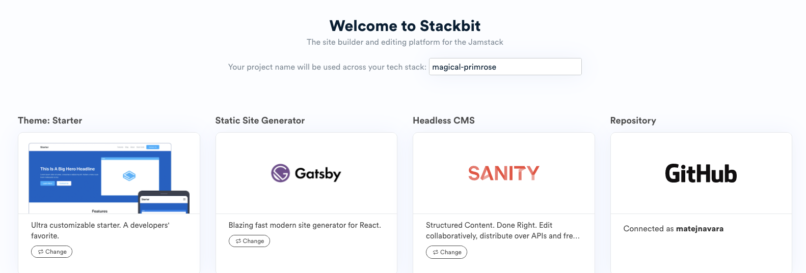

As a comparison I also started a Gatsby blog starter called Novela, CMS and deployment undetermined.

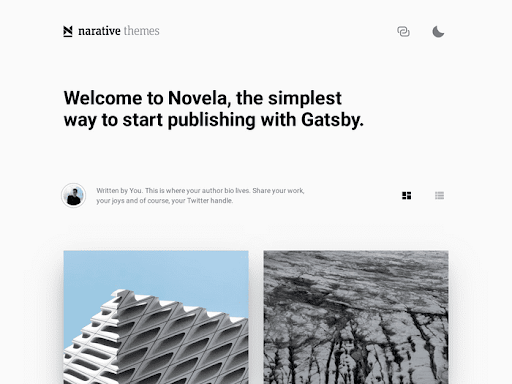

Tomorrow will determine which combination will lead the way.

---

## Day 2 - 02/03/2021

For today I spent some time initially getting my head around the structure of both the Stackbit and the Gatsby Starter projects. Despite both being Gatsby they are structurally rather different as well as the packages they use.

Below is a screenshot comparison of this to better demonstrate it visually.

| /         | Stackbit Starter Blog                                       | Novela Starter                                          |
| --------- | ----------------------------------------------------------- | ------------------------------------------------------- |
| Structure | 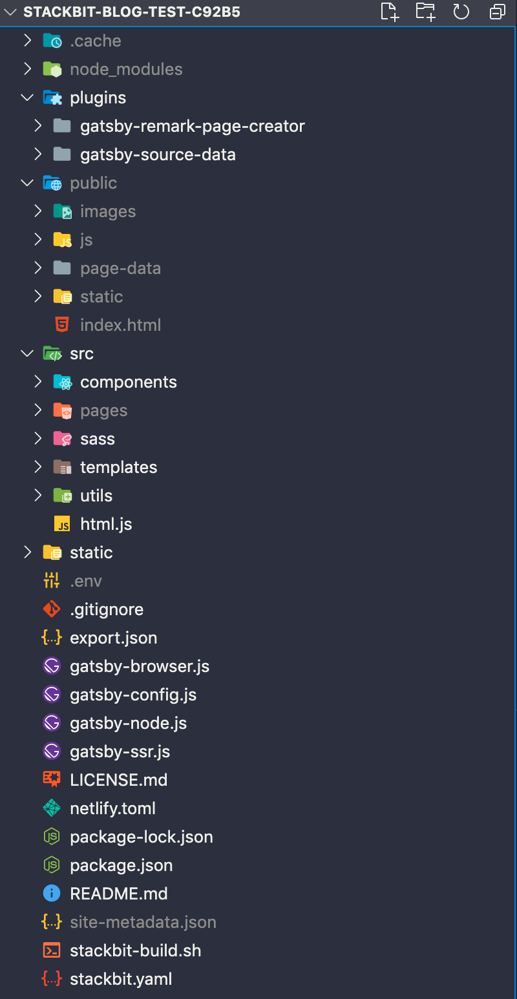 | 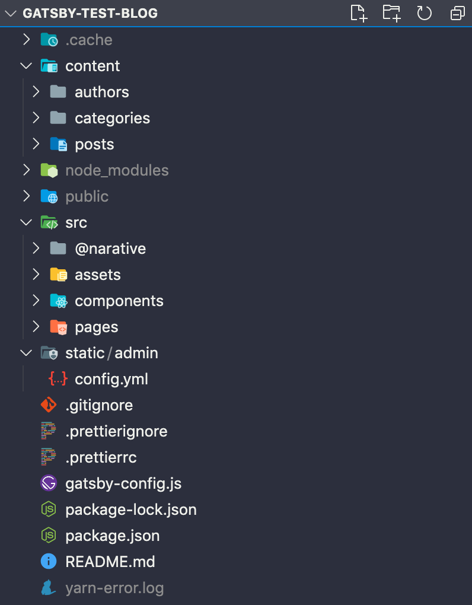 |
| Packages  | 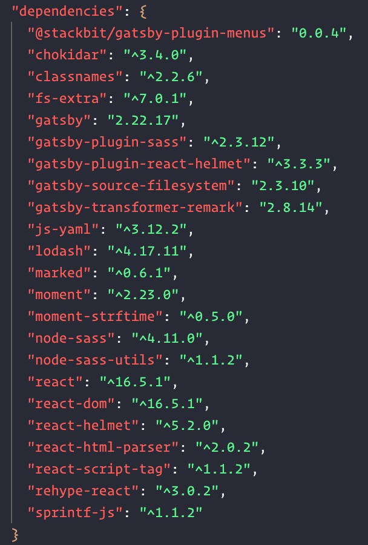       | 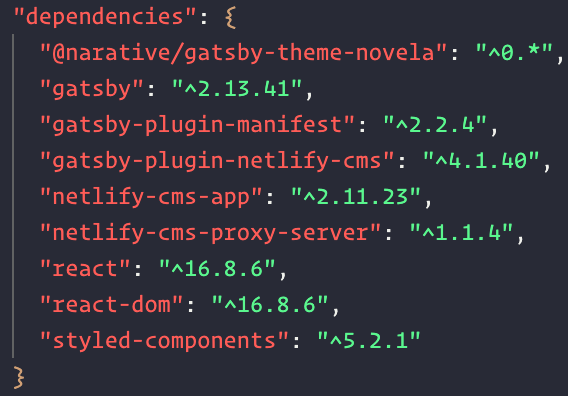       |

Whilst Stackbit is configurable to whichever CMS you prefer (I chose Contentful), it seems the Novela starter is very much geared towards NetlifyCMS out the box. Quite a good opportunity to try both CMSs for a comparison.

Other noticeable differences is that (as of time of writing 002/03/2021) Stackbit is running with Gatsby 2.22 and React 16.5 whilst the Gatsby novela starter is running Gatsby 2.13 and React 16.8. Current latest versions are Gatsby 3.1 and React 17.
Below are the brief changelogs of each to see what are the differences.

React
v16.6.0: lazy, memo and contextType
v16.7.0: bugfix for React.lazy. No API changes.
v16.8.0: The One With Hooks

Interested as to why Stackbit isn’t running a newer post hooks version of React. Would be a nice test to upgrade the projects to see what are the potential breaking changes preventing them from doing this.

In general my chosen starter feels more of a bare bones starter whilst Stackbit already provides you with a lot of features and integrations from the beginning. For this reason I will spend the day coding a bit and working some content into the Stackbit Test Blog first before trying the same on the Novela starter. This will provide a nice comparison which will determine which route to take. All in all I don’t want this blog project to take more than a few days so I can focus on other projects and use the blog for what it is intended, blogging!

---

## Day 3 - 03/03/2021

Today is a deeper dive into the Stackbit stack and how it functions.

Basically:

1. The Stackbit build script pulls data via the Stackbit API using our API key.

2. This populates our project with the Pages and Site MetaData from our chosen CMS.

3. The project builds via `gatsby build --prefix-paths` and deploys via the chosen deployment.

The project has required me to view pages in a different framing with a Content Modelling mindset. The project can be thought about in two realms; the structure and the content.

The Structure: this is the templates, components and styling defined in the codebase and can be edited either in the Stackbit Studio or via your favourite IDE (mine is VS Code).

The Content: this is all the pages, the posts and the site metadata. This is defined in the CMS using the defined content modelling schemas.

Upon building the project content is passed through the structures as JSON and templated as defined. Example:

```javascript
<h1 className="post-title">
  {_.get(this.props, "pageContext.frontmatter.title", null)}
</h1>;
{
  _.get(this.props, "pageContext.frontmatter.subtitle", null) && (
    <div className="post-subtitle">
      {htmlToReact(_.get(this.props, "pageContext.frontmatter.subtitle", null))}
    </div>
  );
}
```

As a test of this pattern I created a new post via Contentful, updated content via Stackbit Studio and also pushed a small styling update via VSCode to confirm they all successfully updated on the live site.

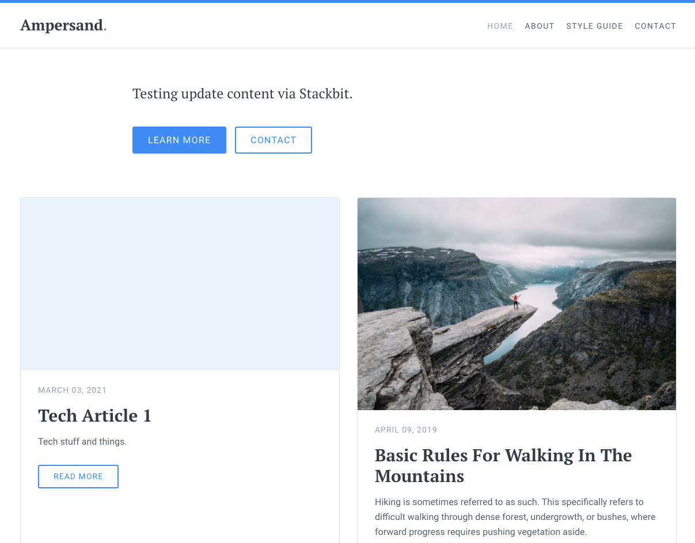

The next step for me in this Stackbit project is to implement “Category†pages which will display posts only of X category. This will test the flexibility of the templates and routing.

Now off to 2 hours of Kickboxing + Boxing ✨

---

## Day 4 - 04/03/2021

Following on from yesterday I have some ToDos I wrote myself to do. These are:

- Rename and refactor current “Home†template/model to “Postsâ€
- Create Category pages
- Filter on page Category

So let’s hit!

First changing the model and expected template of the content on Contentful which as expected broke the site until pushing the respective template name change via Git. Good to know things break as expected.

Now I can create additional “Posts†pages with different content based on the Category. I opted for this instead of a single generic Posts page because the intro content and actions may differ between the 3 core categories (for the time being): Travel, Tech, Thoughts. I want each to feel quite different.

Bit crude but the first iteration works:

```jsx
 filterPostsByCategory = (posts, category) =>
   category
     ? posts.filter(
         (post) => _.get(post, "frontmatter.category", null) == category
       )
     : posts;

 render() {
   const category = _.get(
     this.props,
     "pageContext.frontmatter.category",
     null
   );

   let display_posts = _.orderBy(
     this.filterPostsByCategory(
       getPages(this.props.pageContext.pages, "/posts"),
       category
     ),
     "frontmatter.date",
     "desc"
   );
...
```


Happy days. It’s far from perfect but it’s starting to look like a thing. ToDos are ToDone ğŸ‰

---

## Day 5 - 05/03/2021

Here we are 1/20th through the 100 day challenge. Bit late in the day but that’s okay.

I want to follow on from yesterday and make the navigation and appearance flow a bit more to get a better impression of the platform.

Then I will park the StackBit build and investigate the same for the Novela starter. Firstly trying it as-is with NetlifyCMS but perhaps afterwards even looking into importing the theme into StackBit by adding a stackbit.yaml file.

But I digress, let’s code.

Firstly let’s fix the links and logo:

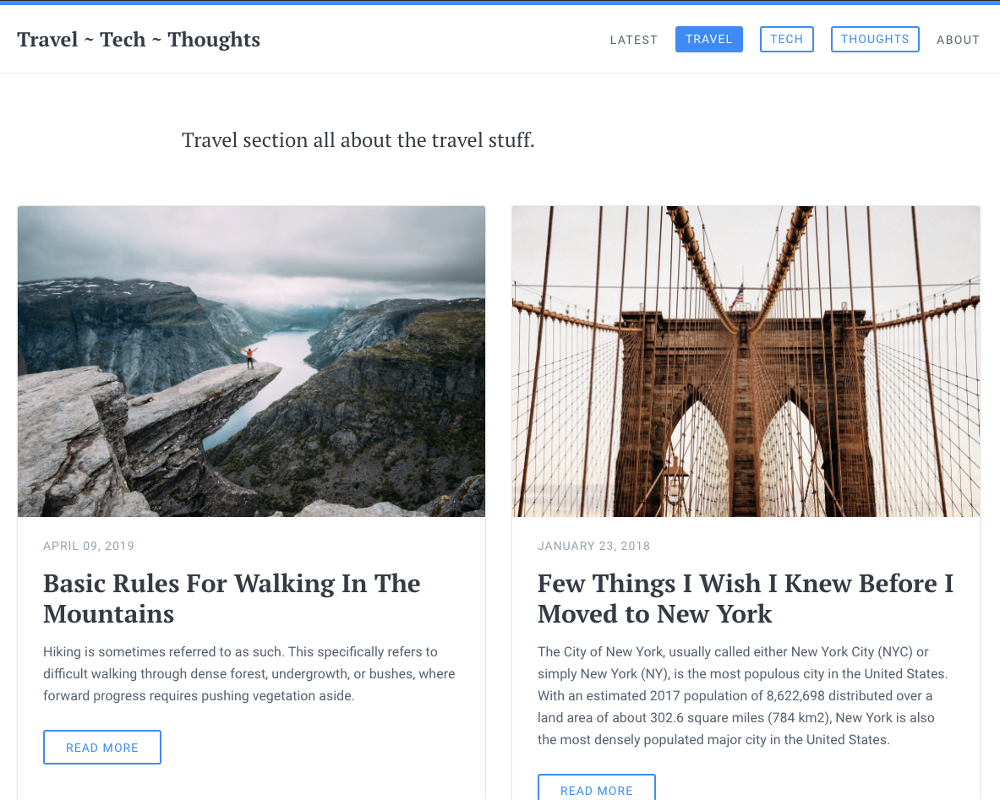

Most was content changes save for some improvements to the Header component and some styling.

Enough for now. Tomorrow will start investigating the Novela Starter to compare.

---

## Day 6 - 06/03/2021

Just set up and got the Novela starter running and honestly… it’s so much cleaner and simpler.

The content is actually stored in the repo and can be interacted via NetlifyCMS locally. Though this can be changed to match the hosted CMS like Contentful, or hook into our existing Contentful content.

But in my opinion as a developer I much prefer having my content in the repo because;

- It’s clearly version controlled on GIT.
- The content modelling is much easier to inspect as code.
- The media is clearly located in the post subfolders.

Basically I don’t like CMS so the more content as code the happier I seem to be. This is definitely a personal preference and the option to edit content via the (very simple) NetlifyCMS is still there. The simplicity is quite nice too since I found Contentful (although very powerful and flexible) very cumbersome and over complicated.

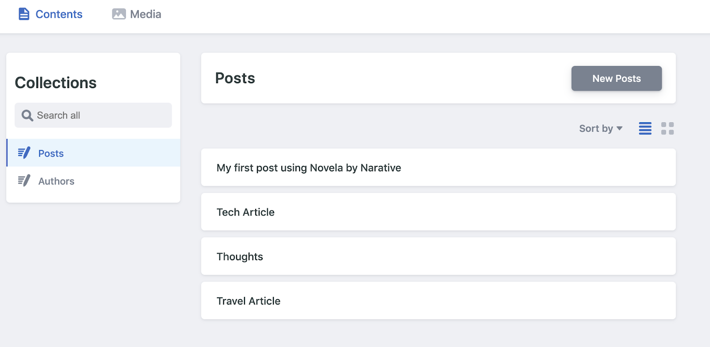

So at the end of a very short 30-45min stint with the Novela starter I already got to grips with it and added some similar custom placeholder content.
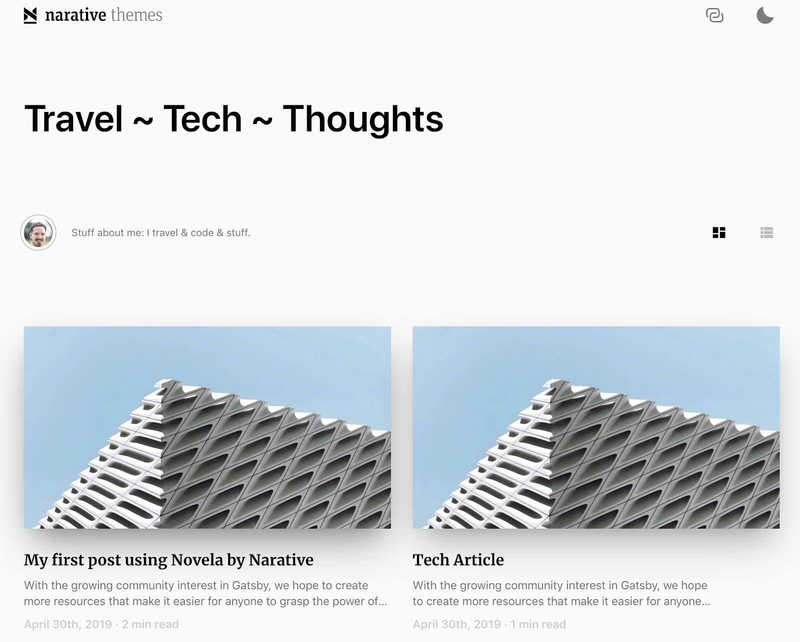

Plus things I love about the theme:

- Night mode toggle (with transition effect)
- Layout options
- Reading estimates
- Progress bar on posts

I think we have a winner. Tomorrow I will hook it up to Netlify for deployment and implement similar category sections.

---

## Day 7 - 07/03/2021

So the Novela starter is an open source theme that is imported and used in the project. However an exciting feature to allow customization is Component Shadowing.

This feature allows users to override a component in order to customize its rendering. Component Shadowing lets you replace the theme’s original file (e.g. gatsby-theme-novela/src/components/Logo.js) with your own to implement any changes you need.

Let’s try this out along with extending the content schema to have “Categoryâ€.
Starting with the latter it was as simple as defining the model in admin/config.yaml with:

```json
  name: "category"
  label: "Category"
  folder: "content/categories"
  create: true
  delete: true
  format: "yml"
  identifier_field: "name"
  fields:
  - { label: Name, name: name, widget: string }
```

Then this new collection can be referenced by Posts with:

```json
fields:
- { label: "Title", name: "title", widget: "string" }
- {
    label: "Author",
    name: "author",
    widget: "relation",
    collection: "authors",
    valueField: "name",
    searchFields: ["name"],
  }
- {
    label: "Category",
    name: "category",
    widget: "relation",
    collection: "category",
    valueField: "name",
    searchFields: ["name"],
  }
```

Nice and simple. The changes are also reflected and editable in the local NetlifyCMS.

As for testing out the Component Shadowing I will swap out the Logo first with some appropriate Emojis ✨

And Boom:


Neat little Emoji Logo component overriding the previous SVG placeholder.

```jsx
import React from "react";
import styled from "styled-components";

import Emoji from "../../../../components/Emoji";

const LogoContainer = styled.div`
  font-size: 50px;

  span {
    padding: 0 10px;
  }
`;

export default function Logo() {
  return (
    <LogoContainer>
      <Emoji symbol="✈ï¸" label="Travel" />
      <Emoji symbol="💻" label="Tech" />
      <Emoji symbol="💭" label="Thoughts" />
    </LogoContainer>
  );
}
```

As for the Emoji component itself it’s a simple functional component that just extends best practices with role/aria-label/aria-hidden for better accessibility.

```jsx
import React from "react";

const Emoji = ({ label, symbol }) => (
  <span
    className="emoji"
    role="img"
    aria-label={label ? label : ""}
    aria-hidden={label ? "false" : "true"}
  >
    {symbol}
  </span>
);

export default Emoji;
```

That’s all for today. Wife is back from 10 days away and we’re off to a little spa day haha.

Tomorrow I will extend the layout controls to include the Category select.

---

## Day 8 - 08/03/2021

Time to apply the Category filter to the Novela theme and see how customisable the starter is. Firstly I started by overriding the existing Articles component, extending the Context API in Articles.List.Context.tsx with a filter state. Then I added simple filter toggles on the existing SubheadingContainer using the same GridButton components with slightly improved styling:

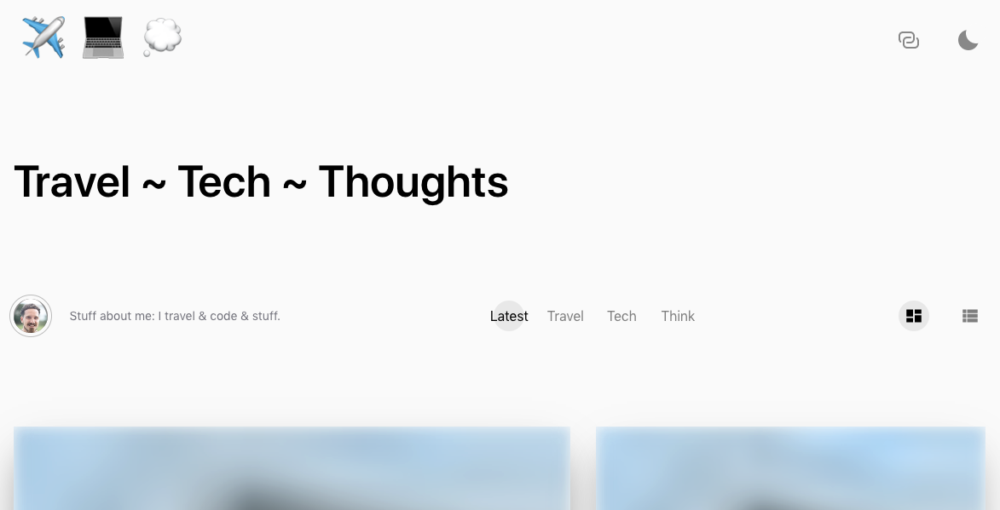

And here came the first stumbling block. Whilst Novela allows component overriding via component shadowing it doesn’t allow much flexibility in the underlying Gatsby/Node config which would be required to extend the content models.

From having a look I came to few solutions to this:

| Solution                                                                                | Impact |
| --------------------------------------------------------------------------------------- | ------ |
| Clone theme repo, alter for purpose and work directly from that with full customization | High   |
| Use slug as basis of categories                                                         | Medium |
| Consider categories as “Authors†and use theme as is                                    | Low    |

Although it would be great to have full customization, the blog is supposed to be a quick start to the 100 Days of Code and I want to get up and running as soon as possible. Thus the latter option is the one I will go with, bit of a cop-out but it will do for the time being!

And Tada ğŸ‰:
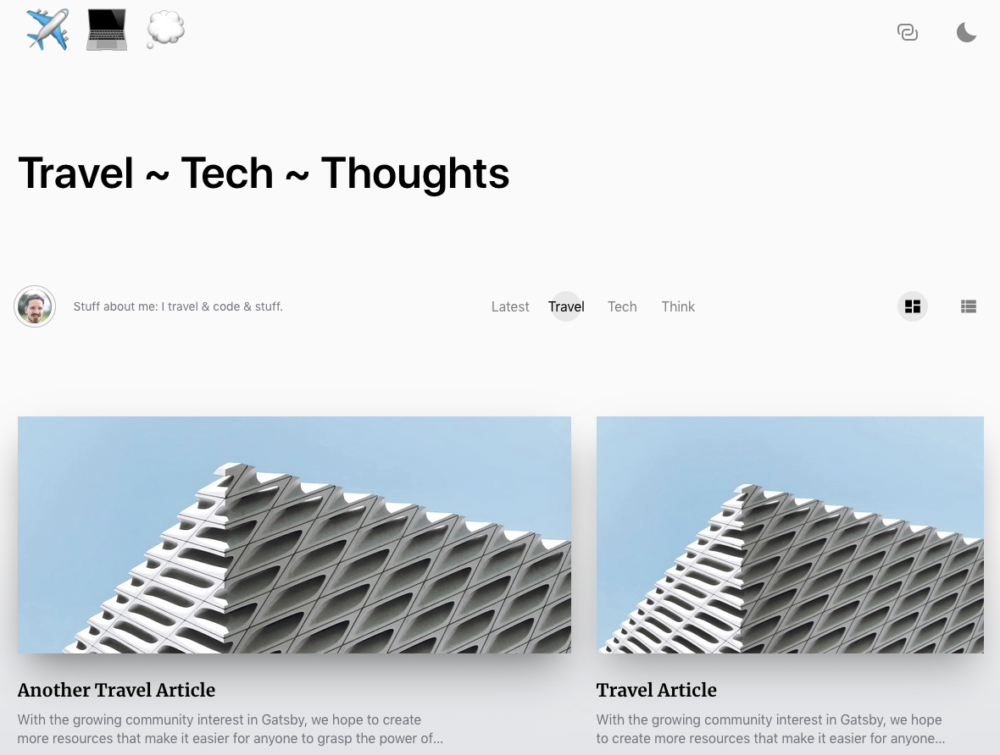

Categories nice and easily with the addition of filtering articles provided to Articles.List.tsx:

```jsx
const articlePairs = articles
  .filter(article => !filter || article.author == filter)
  .reduce((result, value, index, array) => {
    if (index % 2 === 0) {
      result.push(array.slice(index, index + 2));
    }
    return result;
  }, []);
```

Ultimately this is something we would want to filter directly via GraphQL further down the line especially as the number of articles grows but for the time being this will do just fine.

The utilisation of Authors which was already served by the schema allowed this nice quick implementation(hack). Definitely isn’t the prettiest but will be something to extend/fix later.

For now: I have a blog! ✨

Tomorrow I will hook it up to Netlify for deployment.

---

## Day 9 - 09/03/2021

So after the first week I compared two Gatsby stacks and now have a blog. Finally it’s time to deploy it with Netlify after some little cleanup, renaming and making the repo public.

Netlify makes it very simple to deploy by connecting to a chosen Git provider (GitHub in my case) and choosing the repository/branch to deploy:

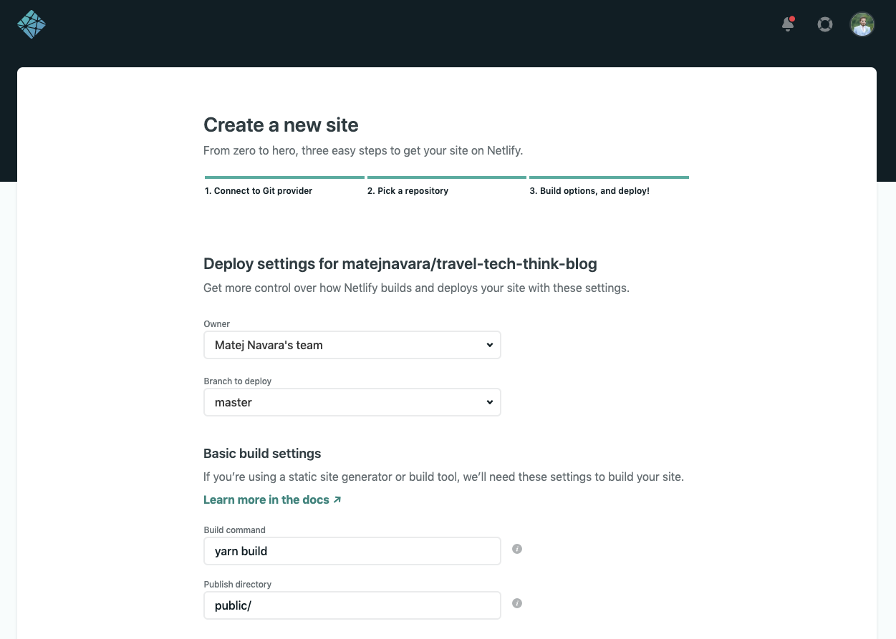

Then just like that the site is deployed:


Currently on https://travel-tech-think-blog.netlify.app

The first deployment with `yarn build` failed, I switched to `npm run build` which worked.

The Netlify platform is packed with features for CI/CD and definitely warrants some further investigation and write-up at a later date.

---

## Day 10 - 10/03/2021

> But now its NEW (Quick) PROJECT TIME ğŸ‰

I have a task to develop a React Native application that can fetch the latest Amazon (AMZN) stock price from an API endpoint and display the last 7 price updates on a graph as well as the current price. If the price has risen for the day, show the price and day change in green, if the price has decreased, display the price in red. If no change, the price will be shown in black. The graph must have a refresh feature.

Firstly some investigation of the API suggested to see the data format I will be working with for stock data.

The two endpoints I will need for this project are the current price of a given stock: [Quote API](https://finnhub.io/docs/api/quote):

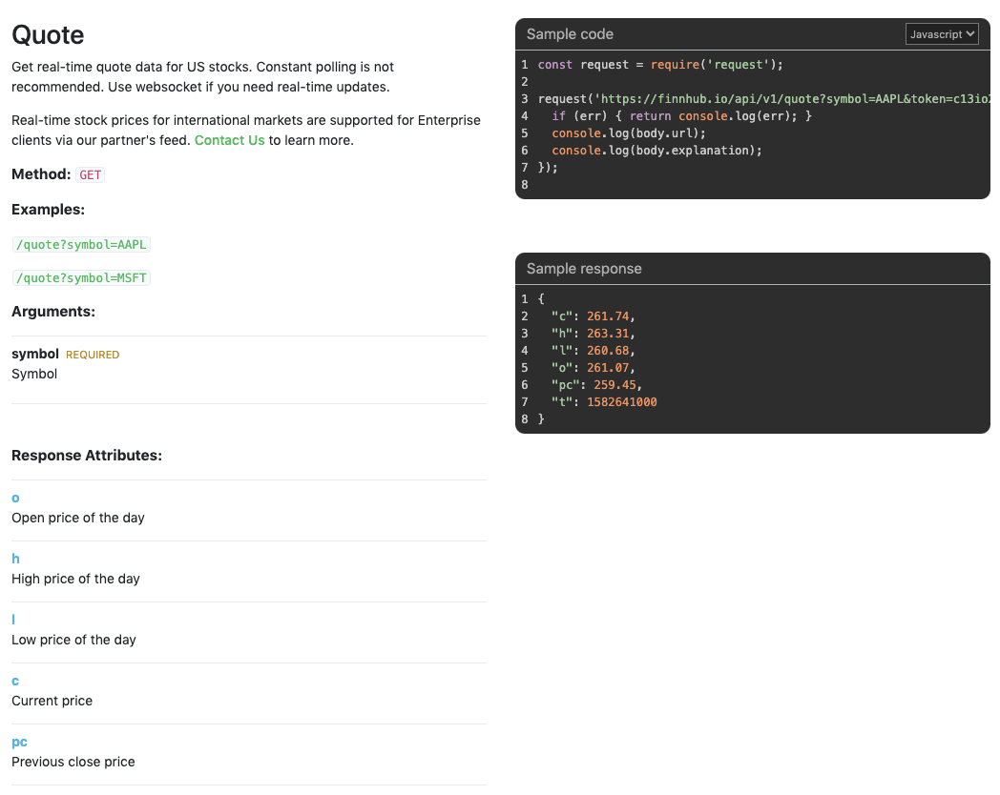

And the candlestick date of the past X days: [Candlestick API](https://finnhub.io/docs/api/stock-candles):

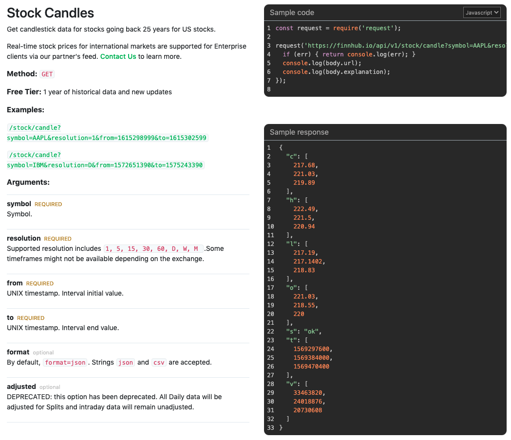

As a start I just set up the RN project from the [Typescript template](react-native-template-typescript) to save some time on the initial config. Also making sure that ESLint and Prettier were in place to follow best practices from the get go before diving in tomorrow.

---

## Day 11 - 11/03/2021

Diving right into the Stonks Viewer App:

### _Implementation/Decision-making_

In terms of implementation I followed the advised tools using RN 0.63, Typescript and Finnhub API. Initially I spent some time familiarising myself with the Finnhub API schema since stock data isn't something I had worked with previously. I originally opted to try the official Finnhub JS package however despite getting the responses I found the package to be fairly poorly documented (particularly for TS) so I switched to Axios which I am more familiar with. I set up the Axios instance with the key passed through the X-Finnhub-Token header and a simple interceptor to handle errors.

```jsx
import Config from "react-native-config";
import axios, { AxiosResponse } from "axios";

interface Error {
  message: string;
  response?: AxiosResponse;
}

const finnhubApi = axios.create({
  baseURL: Config.API_URL,
  headers: {
    Accept: "application/json",
    "Content-Type": "application/json",
    "X-Finnhub-Token": Config.TOKEN
  },
  timeout: 3000
});

export const handleError = (error: Error) => {
  return Promise.reject({
    message: error.message,
    data: error.response?.data,
    status: error.response?.status,
    error
  });
};

finnhubApi.interceptors.response.use(
  response => response,
  error => {
    return handleError(error);
  }
);

export default finnhubApi;
```

The two endpoints and states I pull are the candlestick data for the chart and the quote data for current price. Due to the simplicity of the app I kept components and state at top level however this would be the first thing to improve going forward (will discuss more in next section).

For the graphing tool I decided to use Victory, which rather appropriately has a [candlestick graph](https://formidable.com/open-source/victory/docs/victory-candlestick/) just for this use case. I implemented a utility function to normalise the raw data from the API to the schema required by the chart. I didn't spend too long on the styling of the chart however it is quite flexible in terms of interactivity and styles.

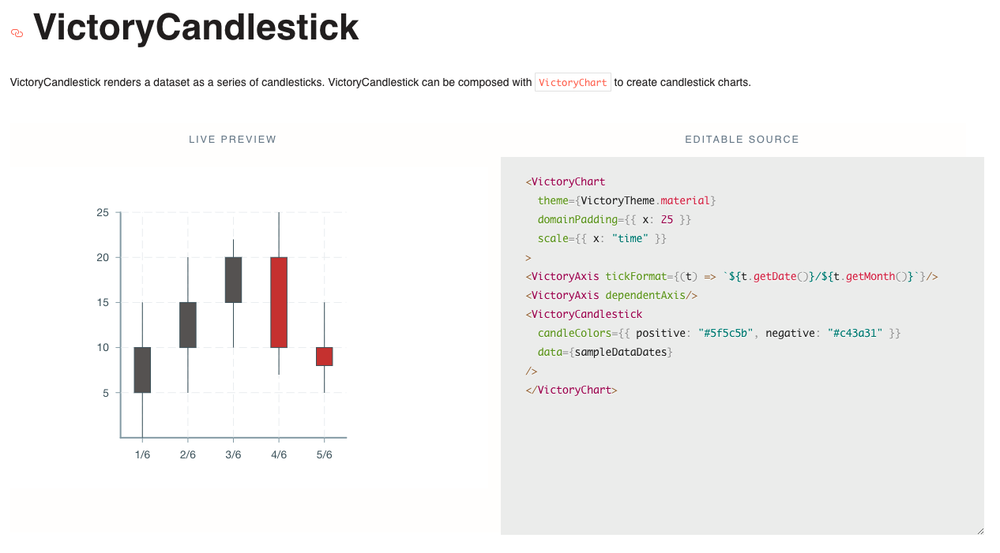

All in all it came out looking like this:

| iOS                                            | Android                                                |
| ---------------------------------------------- | ------------------------------------------------------ |
| 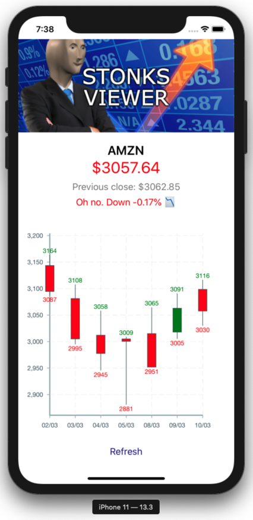 | 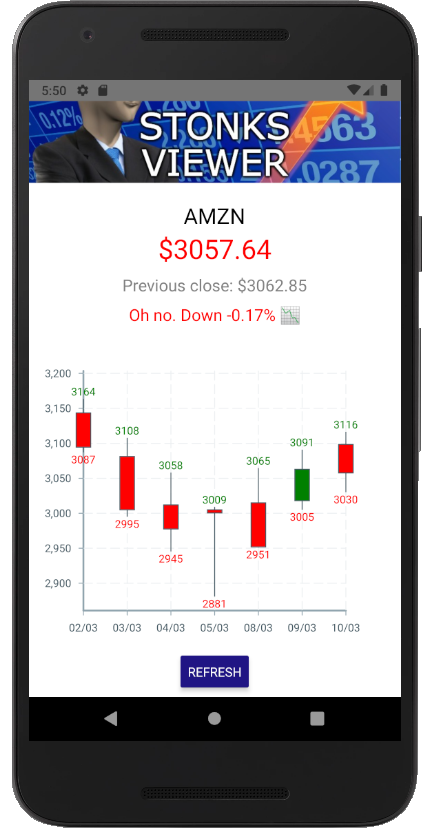 |

### _Limitations/Challenges/Improvements_

For me it was a new experience working with candlestick data which was fun to work with and get a greater understanding of market data even if that's not something I will need on a day to day basis.

Challenges initially were with the Finnhub API, I wanted to utilise their Websockets for the real-time data but it proved to be tricky and the package wasn't well documented. After some playing around I decided to just go with an Axios implementation for the time being to not waste time at the early stages however Websockets would be something I would like to implement as a future improvement. This would address the current limitation of manual refreshing which could be resolved by periodically pinging the endpoints via setInterval but Websockets would definitely be nicer.

The graph could also use some improvement in terms of input interactivity, would be great to show open/close values on press (it looked too busy displaying all of these by default) as well as some dragging/zooming which other libraries supported. Selecting the date range, resolution and stock to display would be other feature improvements. Showing the market open/close would also be helpful as I thought things weren't updating only to realise it was 6am in New York and the market was closed...

In terms of code quality I would look to move the logic into Redux and maybe Sagas (big fan) to better manage the state and flow of data. It would make the debugging and testing of these flows much easier too. On the subject of testing this something I wish I had more time to develop further, currently I just have some simple unit tests on the utilities however it would be great to add component and integration tests (particularly surrounding the data flow).

Given time it would have been nice to serve up the test app via AppCenter however this also takes some time. Overall fun little test with lots of areas to work on further.

You can find all the project files on Github: https://github.com/matejnavara/stonks-watcher-app


---

## Day 12 - 12/03/2021

Coming off the back of the Stocks Viewer it was nice to dive back into React Native and update my local mobile development environment. It also leads well into the project I wish to develop during this #100DaysOfCode challenge which is the Motivication App. I have slowly been theorising this app over the past year but never invested the dedicated time into developing. Now is that time!

But first things first for today I wish to start writing these blogs directly into Markdown on my Git repository. Currently this is a 21 page Google Doc and we’re only 12% through the challenge. Since that is where they will end up anyway it makes much more sense to type up and add any assets/tables/links directly there to save the inevitable lift ‘n shift. Perhaps I will just use Google Docs for grammar/spell checking once an article is done.

So let’s go!

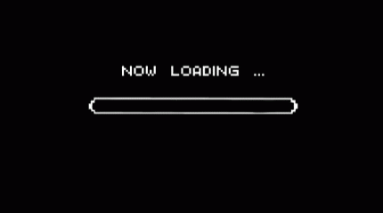

And all migrated! ✨

From 21 pages of Google Doc to 475 lines of Markdown. That took longer than expected going:

| From **THIS**                                       | To _This_                                   |
| --------------------------------------------------- | ------------------------------------------- |
| 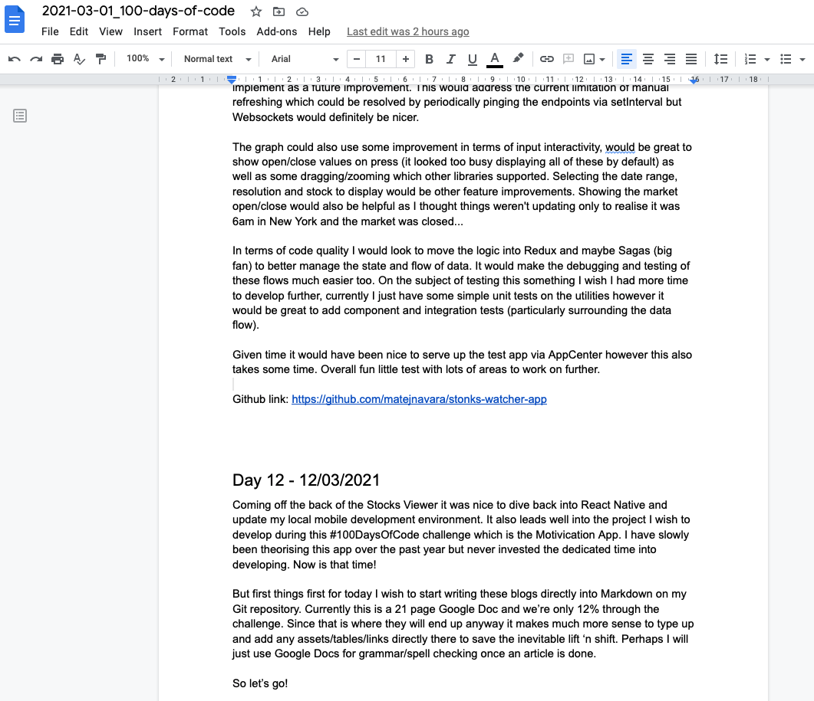 | 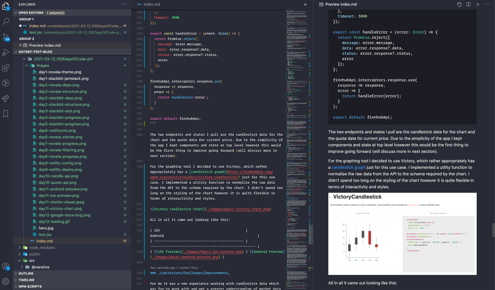 |

Even managed to break Google Docs in the process...
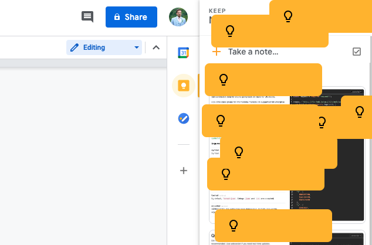

Very fitting for the 100DaysOfCode challenge and staying true to that code life with _**Content as Code**_.

Haters will say that's a bad trade but for the code lovers it's a no brainer:

- This content is now easily transferable anywhere, used on multiple sites/apps/publications without any extra effort.
- It's consistently formatted and structured
- It's version controlled through Git. (Though I know Google Docs also has versioning)

> But ANYWAY: All content from now on is written and structured directly in Markdown. Onwards and upwards! 🚀

## Day 13 - 13/03/2021

Happy 13th. Feels nice to be writing this up in an IDE but maybe that's just me.

So as for today I will update and build off of the Motivication React Native app. I made a start some time ago but not real progress, depending on the state of it I may just start again. Then soon I will begin the start of the Node backend.

Both can be seen in the hasitily drawn whiteboard diagram below:


I swear there is much more ideation already but currently it just lives in my head! As part of this end-to-end development process I will document the write-ups and design of this project.

Diving into the project let's see where I left off:

```bash
commit 73559d4d96bab05fd803c7e54c263b8432a8cd17 (HEAD -> master, origin/master)
Author: Matej
Date:   Sat Aug 22 17:46:00 2020 +0100

    Create alarm screen

commit 3805bda62dd264a1d8e0b1a16bb7f61666243720
Author: Matej
Date:   Tue Aug 11 16:56:17 2020 +0100

    Fix lint issues
```

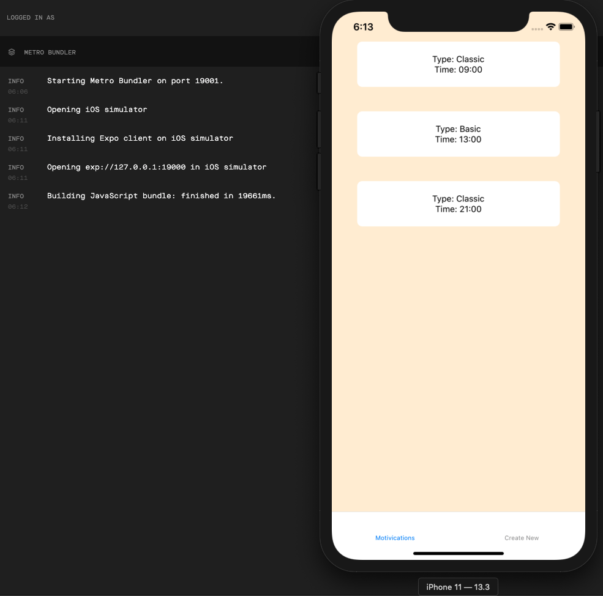

... it's been a while. It also seems I went the Expo route which may not suit the project but we will see.

Let's just start!

## Day 14 - 14/03/2021

Today is Balinese New Year known as Nyepi, the day of silence. No lights, no noise, no travel, no electricity/internet (although it seems okay so far).

Regardless we still out here coding! :tech:


Yesterday was mostly catching up on what was done and fixing the edit screen.

I actually realise the internet is not strong enough to load the packages to fire up the app so today will be untested code on a seperate branch called... `nyepi-coding`.

Not a lot of coding today but I will combine the alarm edit modal and the create alarm screen into one. They are basically the same screen after all.

## Day 15 - 15/03/2021

The night sky was incredible. The electricity/internet was still available but not advised. What a sky without that light pollution.

Now back in the land of light.

Prior to some code I did a bit of research around the Push Notification service for the Motivication app. Looking at free tiers initially whilst it's still an MVP. Scaling will be a good problem to face further down the line.

### Push Notification Services (Free Tiers)

| Service                                  | Monthly Limit | Max Connections | Additional Notes                                               | Review     |
| ---------------------------------------- | ------------- | --------------- | -------------------------------------------------------------- | ---------- |
| [Expo](https://expo.io/)                 | Unlimited     | Unlimited?      | Already integrated, uses FCM and has other mobile dev features | 🌕🌕🌕🌕🌗 |
| [Ably](https://ably.com/)                | 3 mill        | 100             | ...                                                            | 🌕🌕🌕🌑🌑 |
| [OneSignal](https://onesignal.com/)      | Unlimited     | Unlimited       | No Scheduled send?                                             | 🌕🌕🌕🌕🌑 |
| [Pusher Beams](https://pusher.com/beams) | Unlimited     | 1000            | Relies on FCM                                                  | 🌕🌕🌕🌗🌑 |
| [PubNub](https://www.pubnub.com/)        | Unlimited     | 200 MAUs        | Falls back on FCM, looks simple                                | 🌕🌕🌕🌗🌑 |
| [Courier](https://www.courier.com/)      | 10k           | Unlimited       | Many integrations, notification designer                       | 🌕🌕🌕🌗🌑 |
| [Backendless](https://backendless.com/)  | Unlimited     | Unlimited       | Has a lot of fieatures but have to do training for free tier?  | ?          |

Still inconclusive but will initially implement with Expo and FCM since it's mostly already integrated.

But first some continuation on the front-end to create/edit/remove local alarms.


After some quick/questionable coding (which will be refactored later anyway) we have some alarms creating, editing and removing locally.

| HomePage                                                | Create Alarm                                                | Edit/Remove Alarm                                                |
| ------------------------------------------------------- | ----------------------------------------------------------- | ---------------------------------------------------------------- |
| 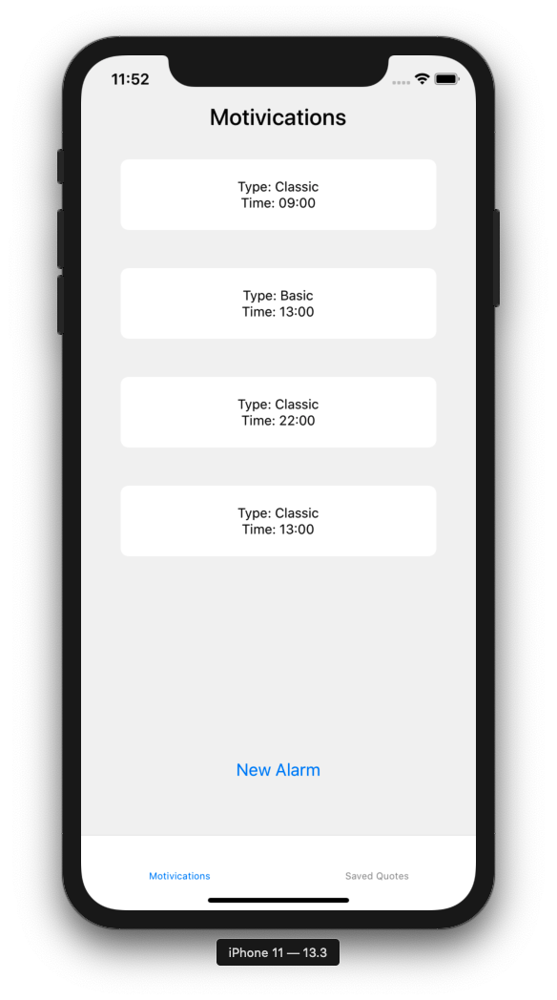 | 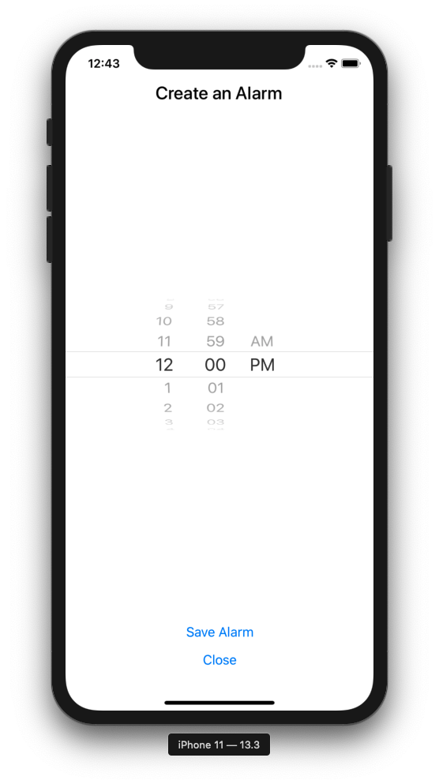 | 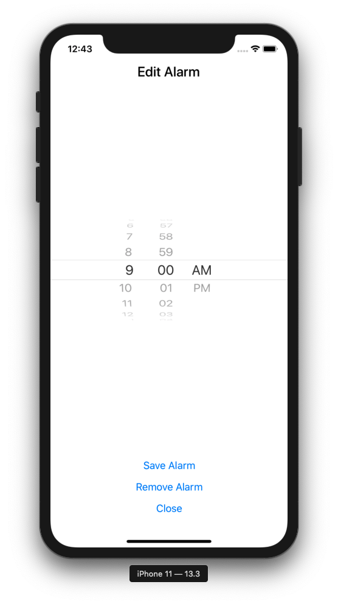 |

Pretty basic but it's progress nontheless.

Tomorrow I will add the type selector.
