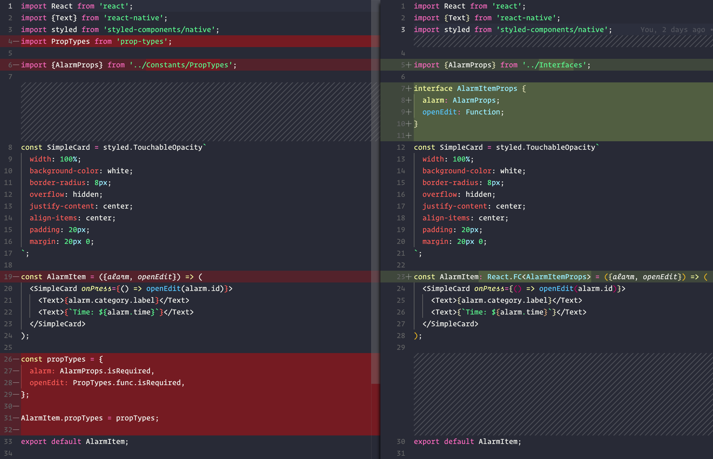
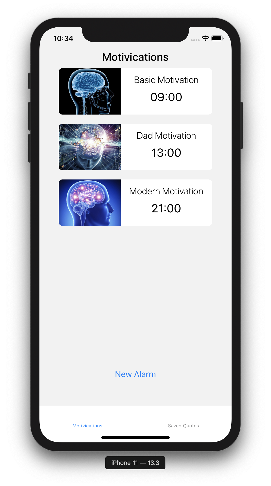
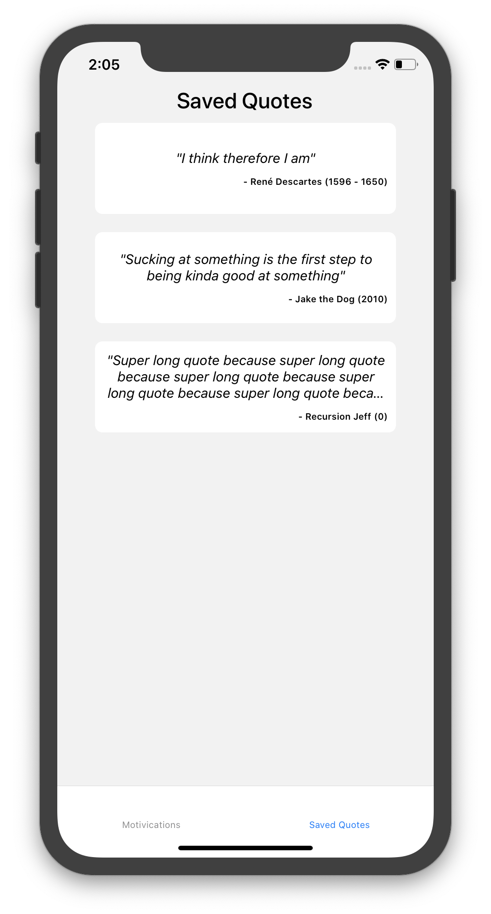

# **#100DaysOfCode Part 2** _(Day 21-40)_

## Day 21 - 21/03/2021

Another day another code.

I realise the writeup for part 1 was quite long so I will keep the notes a bit more summative unless there is some cool discovery/process.

Today is coverting components day. JSX -> TSX.

Here is one I prepared earlier:



Overall a few lines lighter than PropTypes.

---

## Day 22 - 22/03/2021

Today finished up the TSX conversion. Feels good man.

Going forward everything will be written in Typescript and I will clean up any remaining bits as I move forward. Starting with removing `Constants/PropTypes.js` constants and the dependency:

```
yarn remove prop-types
```

~~Refactor into Typescript~~

Happy days 🎉

---

## Day 23 - 23/03/2021

Today is a friend's birthday on the boat and we finally returned to some reception zone so I can push up all the changes.

Let's look at the latest ToDos:

### Offline Raja Ampat Boat Coding ToDos
  * ~~Create saved motivications screen~~
  * ~~Create motivication modal display~~
  * ~~Refactor into Typescript~~
  * Add Redux (maybe Sagas)
  * Start Motivication API
  * Better Quote modal styling (responsive font size)
  * Better Alarm cards
  * Better Quote cards

Catching up, cleaning up and pushing up all the recent changes.

Now I will start moving into some styling to improve the cards/modals.

---

## Day 24 - 24/04/2021

Bit of a hungover day.

Played around with the Alarm card styling.



A little better for now.

  * ~~Better Alarm cards~~

---

## Day 25 - 25/04/2021

Penultimate day on the boat.

### Offline Raja Ampat Boat Coding ToDos
  * ~~Create saved motivications screen~~
  * ~~Create motivication modal display~~
  * ~~Refactor into Typescript~~
  * Add Redux (maybe Sagas)
  * Start Motivication API
  * Better Quote modal styling (responsive font size)
  * ~~Better Alarm cards~~
  * Better Quote cards

Gonna hit the quote card and modal improvements.

Battery running low.

Will be a light day, trying to solve the scaling modal font issue. I think an algortihm helper for font sizing based on the quote length and the pixel density.

Will require some good testing across devices though.

In terms of quote card I just made a small improvement to the text sizing and limiting it to 3 lines of quote text.

Also moved PlainCard styled component to `global.styles.js` for use on both card components.

So now the quote cards look like:



  * ~~Better Quote cards~~

Sleep time. 15%.

---

