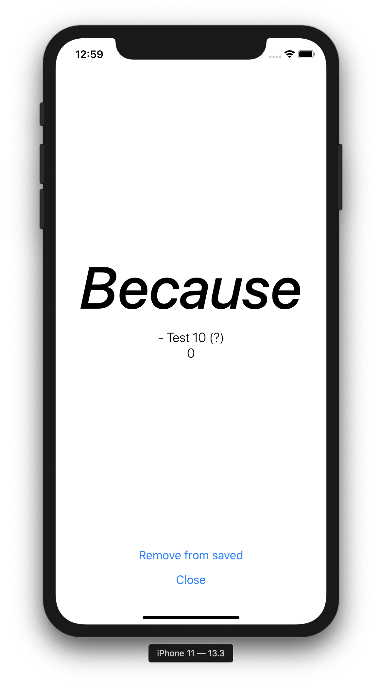
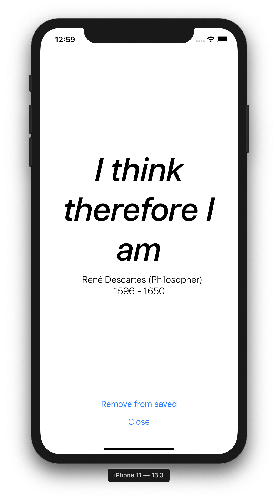
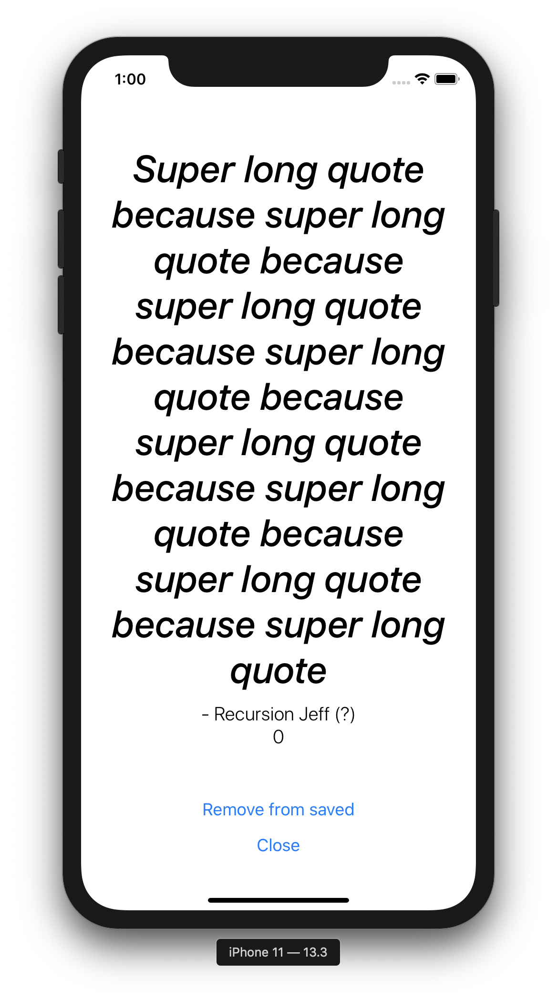

# **#100DaysOfCode Part 2** _(Day 21-40)_

## Day 21 - 21/03/2021

Another day another code.

I realise the writeup for part 1 was quite long so I will keep the notes a bit more summative unless there is some cool discovery/process.

Today is coverting components day. JSX -> TSX.

Here is one I prepared earlier:


Overall a few lines lighter than PropTypes.

---

## Day 22 - 22/03/2021

Today finished up the TSX conversion. Feels good man.

Going forward everything will be written in Typescript and I will clean up any remaining bits as I move forward. Starting with removing `Constants/PropTypes.js` constants and the dependency:

```
yarn remove prop-types
```

~~Refactor into Typescript~~

Happy days 🎉

---

## Day 23 - 23/03/2021

Today is a friend's birthday on the boat and we finally returned to some reception zone so I can push up all the changes.

Let's look at the latest ToDos:

### Offline Raja Ampat Boat Coding ToDos

- ~~Create saved motivications screen~~
- ~~Create motivication modal display~~
- ~~Refactor into Typescript~~
- Add Redux (maybe Sagas)
- Start Motivication API
- Better Quote modal styling (responsive font size)
- Better Alarm cards
- Better Quote cards

Catching up, cleaning up and pushing up all the recent changes.

Now I will start moving into some styling to improve the cards/modals.

---

## Day 24 - 24/04/2021

Bit of a hungover day.

Played around with the Alarm card styling.


A little better for now.

- ~~Better Alarm cards~~

---

## Day 25 - 25/03/2021

Penultimate day on the boat.

### Offline Raja Ampat Boat Coding ToDos

- ~~Create saved motivications screen~~
- ~~Create motivication modal display~~
- ~~Refactor into Typescript~~
- Add Redux (maybe Sagas)
- Start Motivication API
- Better Quote modal styling (responsive font size)
- ~~Better Alarm cards~~
- Better Quote cards

Gonna hit the quote card and modal improvements.

Battery running low.

Will be a light day, trying to solve the scaling modal font issue. I think an algortihm helper for font sizing based on the quote length and the pixel density.

Will require some good testing across devices though.

In terms of quote card I just made a small improvement to the text sizing and limiting it to 3 lines of quote text.

Also moved PlainCard styled component to `global.styles.js` for use on both card components.

So now the quote cards look like:


- ~~Better Quote cards~~

Sleep time. 15%.

---

## Day 26 - 26/03/2021

Back on dry land after 8 days aboard the A'Boya. All was a success but now a rather stressed evening trying to figure out logistics and finances without much internet or any verification via 2FA (no signal in Raja Ampat).

Regardless the 100DaysOfCode carries on!

I will implement an initial and crude font scaling helper.

```ts
export const GetMaxFontSize = (quote: QuoteProps) => {
  const quoteLength = quote.quote.length;
  let fontSize = 20;
  if (quoteLength < 10) {
    fontSize = 45;
  } else if (quoteLength < 20) {
    fontSize = 40;
  } else if (quoteLength < 30) {
    fontSize = 35;
  } else if (quoteLength < 40) {
    fontSize = 30;
  } else if (quoteLength < 50) {
    fontSize = 25;
  }
  return fontSize * PixelRatio.get();
};
```

Don't judge me...

At least it utilises the PixelRatio of the device. Will refine this into a more elegant solution further down the line but for now it does the trick:

| Small Quote                                    | Medium Quote                                     | Large Quote                                    |
| ---------------------------------------------- | ------------------------------------------------ | ---------------------------------------------- |
|  |  |  |

Up in 6 hours to head into the jungle for some birds of paradise (hopefully).

---

## Day 27 - 27/03/2021

Long moving day and the last before we get back to base.

Given the decent internet at this Sorong hotel I will do the initial set up for Redux on the project.

### Offline Raja Ampat Boat Coding ToDos

- ~~Create saved motivications screen~~
- ~~Create motivication modal display~~
- ~~Refactor into Typescript~~
- **Add Redux (maybe Sagas)**
- Start Motivication API
- ~~Better Quote modal styling (responsive font size)~~
- ~~Better Alarm cards~~
- ~~Better Quote cards~~

Started by adding the necessary packages

```
yarn add redux react-redux
```

Decided against any additional middleware for now.

Then comes the Actions/Reducers for Alarms.

```ts
export const addAlarm = (alarm: AlarmProps) => ({
  type: "ADD_ALARM",
  payload: alarm
});

export const editAlarm = (alarm: AlarmProps) => ({
  type: "EDIT_ALARM",
  payload: alarm
});

export const removeAlarm = (alarmId: number) => ({
  type: "REMOVE_ALARM",
  payload: alarmId
});
```

---

## Day 28 - 28/03/2021

Long travel day, will be a short one. Just including Redux in the app:

```jsx
import React from "react";
import { Provider } from "react-redux";
import { createStore } from "redux";
import { NavigationContainer } from "@react-navigation/native";
import { createBottomTabNavigator } from "@react-navigation/bottom-tabs";

import AlarmsReducer from "./src/Redux/Reducers/Alarms";
import AlarmScreen from "./src/Screens/AlarmScreen";
import QuoteScreen from "./src/Screens/QuoteScreen";

const Tab = createBottomTabNavigator();

const store = createStore(AlarmsReducer);

export default function App() {
  return (
    <Provider store={store}>
      <NavigationContainer>
        <Tab.Navigator>
          <Tab.Screen name="Motivications" component={AlarmScreen} />
          <Tab.Screen name="Saved Quotes" component={QuoteScreen} />
        </Tab.Navigator>
      </NavigationContainer>
    </Provider>
  );
}
```

Here we created the store with the initial `AlarmReducer` which is then passed to the app via the Provider.

---
