---


You shouldn't be here...

But since you're here anyway, have a gander.

I can't stop you anwyay. But remember, Jesus is watching.

`To-Do: Restrict URL of future articles`

---

---

## 🄳🄸🅂🄲🄻🄰🄸🄼🄴🅁

This is not a structured blog post but a raw ongoing log of progress during the 100DaysOfCode challenge.

It is long. It isn't proof read or spellchecked. There will be bugs and typos.

Don't judge. You have been warned. Now go forth;


---

# **#100DaysOfCode Part 2** _(Day 21-40)_

## Day 21 - 21/03/2021

Another day another code.

I realise the writeup for part 1 was quite long so I will keep the notes a bit more summative unless there is some cool discovery/process.

Today is coverting components day. JSX -> TSX.

Here is one I prepared earlier:

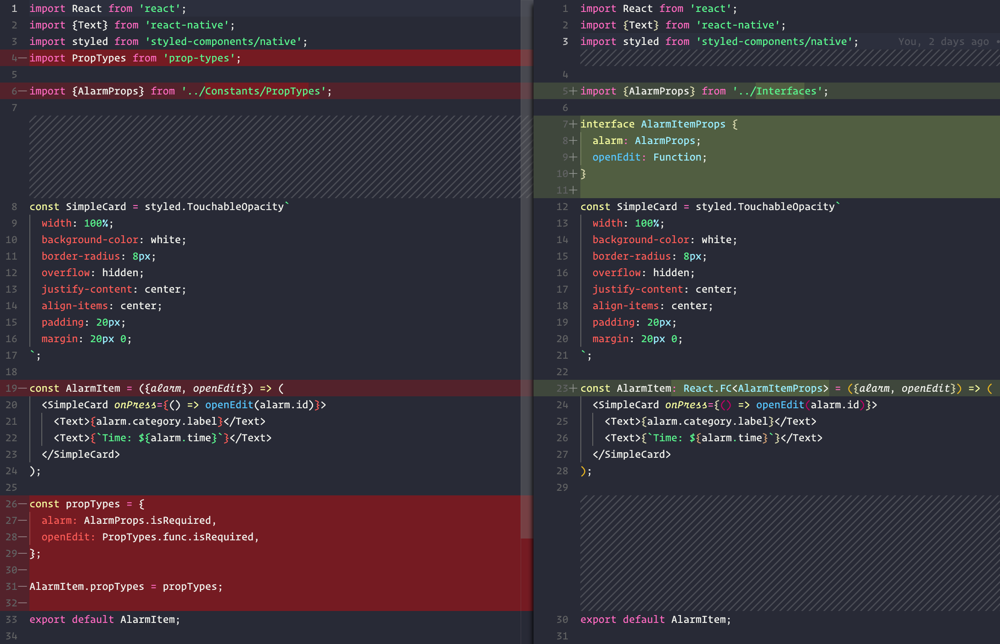

Overall a few lines lighter than PropTypes.

---

## Day 22 - 22/03/2021

Today finished up the TSX conversion. Feels good man.

Going forward everything will be written in Typescript and I will clean up any remaining bits as I move forward. Starting with removing `Constants/PropTypes.js` constants and the dependency:

```
yarn remove prop-types
```

~~Refactor into Typescript~~

Happy days 🎉

---

## Day 23 - 23/03/2021

Today is a friend's birthday on the boat and we finally returned to some reception zone so I can push up all the changes.

Let's look at the latest ToDos:

### Offline Raja Ampat Boat Coding ToDos

- ~~Create saved motivications screen~~
- ~~Create motivication modal display~~
- ~~Refactor into Typescript~~
- Add Redux (maybe Sagas)
- Start Motivication API
- Better Quote modal styling (responsive font size)
- Better Alarm cards
- Better Quote cards

Catching up, cleaning up and pushing up all the recent changes.

Now I will start moving into some styling to improve the cards/modals.

---

## Day 24 - 24/04/2021

Bit of a hungover day.

Played around with the Alarm card styling.

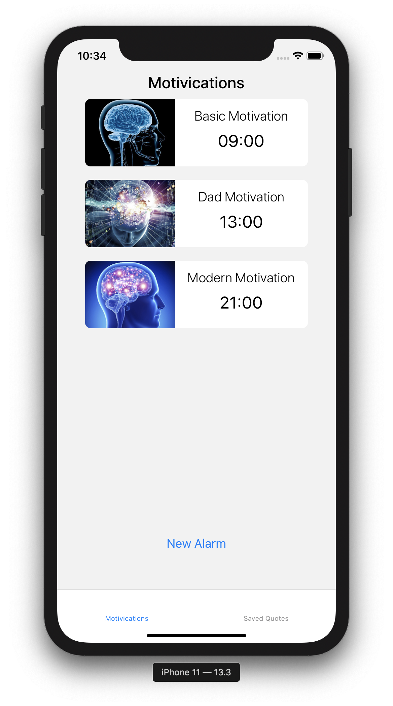

A little better for now.

- ~~Better Alarm cards~~

---

## Day 25 - 25/03/2021

Penultimate day on the boat.

### Offline Raja Ampat Boat Coding ToDos

- ~~Create saved motivications screen~~
- ~~Create motivication modal display~~
- ~~Refactor into Typescript~~
- Add Redux (maybe Sagas)
- Start Motivication API
- Better Quote modal styling (responsive font size)
- ~~Better Alarm cards~~
- Better Quote cards

Gonna hit the quote card and modal improvements.

Battery running low.

Will be a light day, trying to solve the scaling modal font issue. I think an algortihm helper for font sizing based on the quote length and the pixel density.

Will require some good testing across devices though.

In terms of quote card I just made a small improvement to the text sizing and limiting it to 3 lines of quote text.

Also moved PlainCard styled component to `global.styles.js` for use on both card components.

So now the quote cards look like:

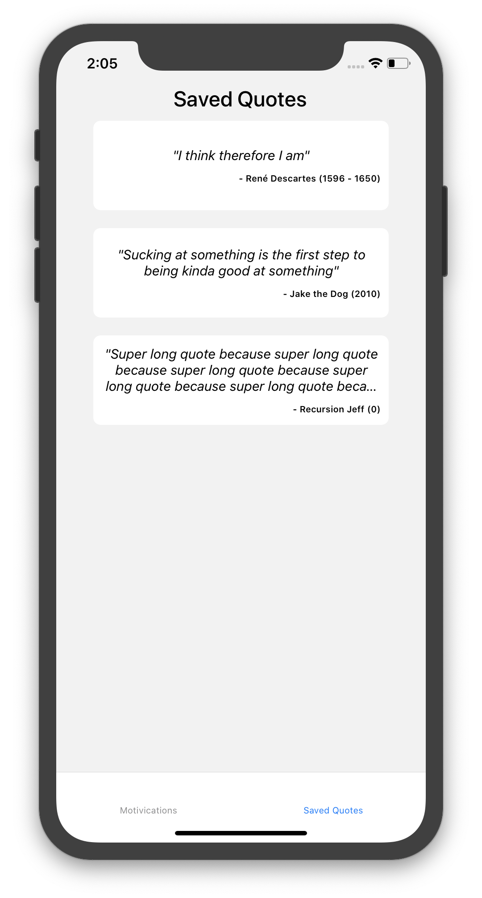

- ~~Better Quote cards~~

Sleep time. 15%.

---

## Day 26 - 26/03/2021

Back on dry land after 8 days aboard the A'Boya. All was a success but now a rather stressed evening trying to figure out logistics and finances without much internet or any verification via 2FA (no signal in Raja Ampat).

Regardless the 100DaysOfCode carries on!

I will implement an initial and crude font scaling helper.

```ts
export const GetMaxFontSize = (quote: QuoteProps) => {
  const quoteLength = quote.quote.length;
  let fontSize = 20;
  if (quoteLength < 10) {
    fontSize = 45;
  } else if (quoteLength < 20) {
    fontSize = 40;
  } else if (quoteLength < 30) {
    fontSize = 35;
  } else if (quoteLength < 40) {
    fontSize = 30;
  } else if (quoteLength < 50) {
    fontSize = 25;
  }
  return fontSize * PixelRatio.get();
};
```

Don't judge me...

At least it utilises the PixelRatio of the device. Will refine this into a more elegant solution further down the line but for now it does the trick:

| Small Quote                                    | Medium Quote                                     | Large Quote                                    |
| ---------------------------------------------- | ------------------------------------------------ | ---------------------------------------------- |
| 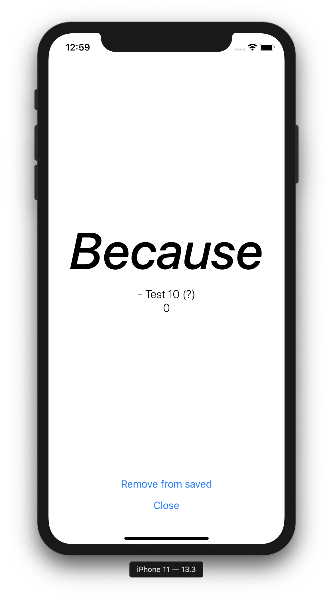 | 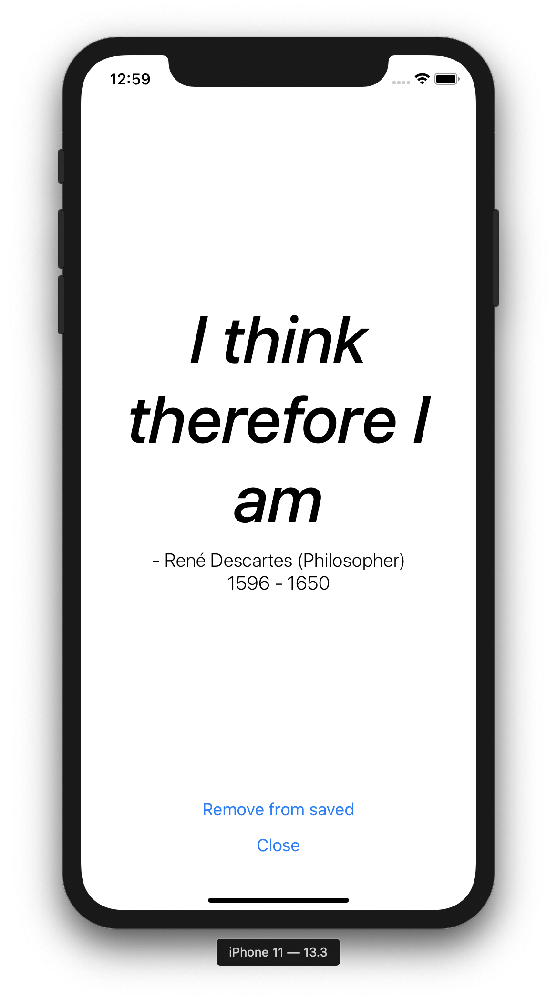 | 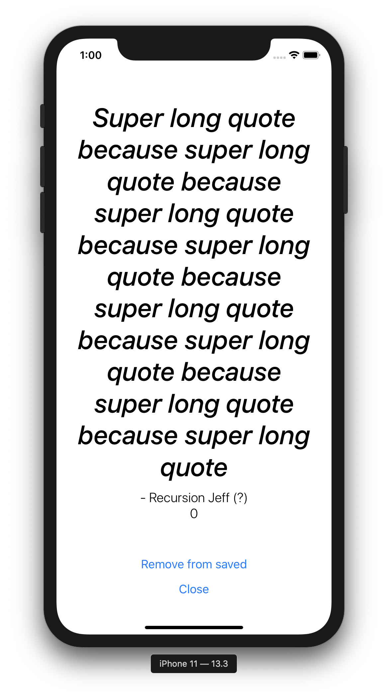 |

Up in 6 hours to head into the jungle for some birds of paradise (hopefully).

---

## Day 27 - 27/03/2021

Long moving day and the last before we get back to base.

Given the decent internet at this Sorong hotel I will do the initial set up for Redux on the project.

### Offline Raja Ampat Boat Coding ToDos

- ~~Create saved motivications screen~~
- ~~Create motivication modal display~~
- ~~Refactor into Typescript~~
- **Add Redux (maybe Sagas)**
- Start Motivication API
- ~~Better Quote modal styling (responsive font size)~~
- ~~Better Alarm cards~~
- ~~Better Quote cards~~

Started by adding the necessary packages

```
yarn add redux react-redux
```

Decided against any additional middleware for now.

Then comes the Actions/Reducers for Alarms.

```ts
export const addAlarm = (alarm: AlarmProps) => ({
  type: "ADD_ALARM",
  payload: alarm
});

export const editAlarm = (alarm: AlarmProps) => ({
  type: "EDIT_ALARM",
  payload: alarm
});

export const removeAlarm = (alarmId: number) => ({
  type: "REMOVE_ALARM",
  payload: alarmId
});
```

---

## Day 28 - 28/03/2021

Long travel day, will be a short one. Just including Redux in the app:

```jsx
import React from "react";
import { Provider } from "react-redux";
import { createStore } from "redux";
import { NavigationContainer } from "@react-navigation/native";
import { createBottomTabNavigator } from "@react-navigation/bottom-tabs";

import AlarmsReducer from "./src/Redux/Reducers/Alarms";
import AlarmScreen from "./src/Screens/AlarmScreen";
import QuoteScreen from "./src/Screens/QuoteScreen";

const Tab = createBottomTabNavigator();

const store = createStore(AlarmsReducer);

export default function App() {
  return (
    <Provider store={store}>
      <NavigationContainer>
        <Tab.Navigator>
          <Tab.Screen name="Motivications" component={AlarmScreen} />
          <Tab.Screen name="Saved Quotes" component={QuoteScreen} />
        </Tab.Navigator>
      </NavigationContainer>
    </Provider>
  );
}
```

Here we created the store with the initial `AlarmReducer` which is then passed to the app via the Provider.

---

## Day 29 - 29/03/2021

First day back at base but lots of other bits to do. For the code of the day I will just utilise the Alarm redux actions in the code and connect the necessary components. However this time I will use the hooks implementation of Redux using the `useStore` hook rather than the verbose `mapStateToProps` connect HOC implementation.

I also added a `Redux/ActionTypes.ts` constants file to store these global actions:

```ts
export const AlarmActionTypes = {
  ADD_ALARM: "ADD_ALARM",
  EDIT_ALARM: "EDIT_ALARM",
  REMOVE_ALARM: "REMOVE_ALARM"
};
```

---

## Day 30 - 30/03/2021

Slowly getting back into the swing of things. Today wrapping up the Redux implementation.

With the addition of the new `quotes.reducer.ts` I now combine the reducers in a seperate `root.reducer.ts`.

```ts
import { combineReducers } from "redux";

import alarmsReducer from "./alarms.reducer";
import quotesReducer from "./quotes.reducer";

export default combineReducers({
  alarms: alarmsReducer,
  quotes: quotesReducer
});
```

Bit torn on naming convention but currently gone with `<domain>.<type>.ts`. File seperation is by type and the naming gives clear context when searching by the domain.

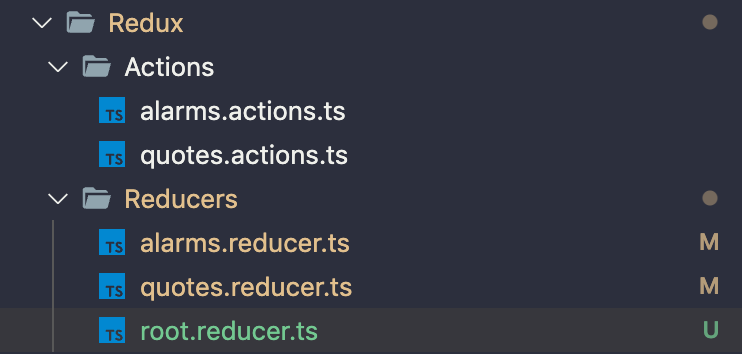

Basic Redux now implemented and working.

- ~~Add Redux (maybe Sagas)~~

---

## Day 31 - 31/03/2021

Last day of March!

Today I'll actually change tack to work on the Blog since tomorrow I want to go live with it. For this I will implement a coming soon feature based on the article date.

If the article is in the future it won't be accessible and will have some "Coming Soon" messaging.

This will be useful since most of my articles are still in progress but it can still show what's coming up.

Simple little snippet:

```ts
const articleInFuture = date => {
  const articleDate = moment(date, "MMMM Do, YYYY");
  return moment().isBefore(articleDate);
};
```

Based on the Boolean return of this helper we can apply styling changes as needed. Currently I just made a few small changes:

- removed the cursor pointer on hover.
- replaced the post details with 'Coming Soon...'
- grayscale the post image.

Basic but works.

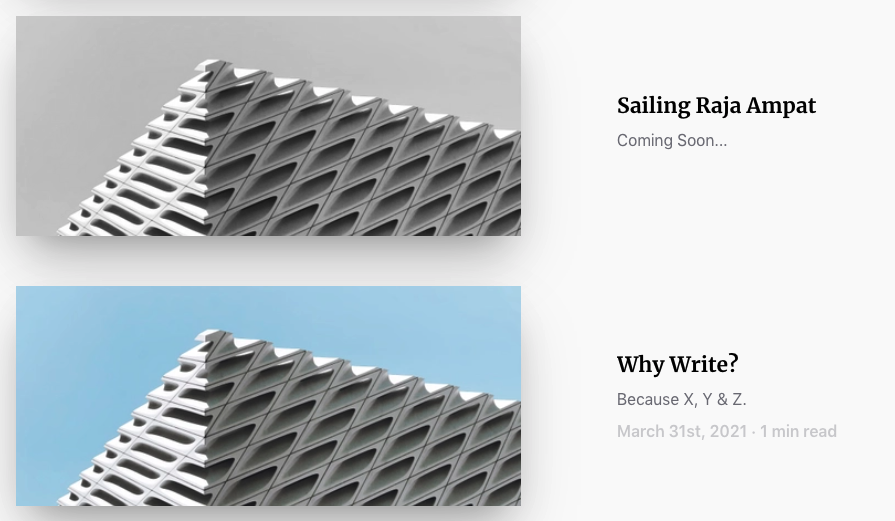

Tomorrow will be content and go live day! ✨

---

## Dat 32 - 01/04/2012

A lot of progress today getting the content ready and fixing little issues across the site. You can see all on the [Git repo](https://github.com/matejnavara/travel-tech-think-blog/commits/master).

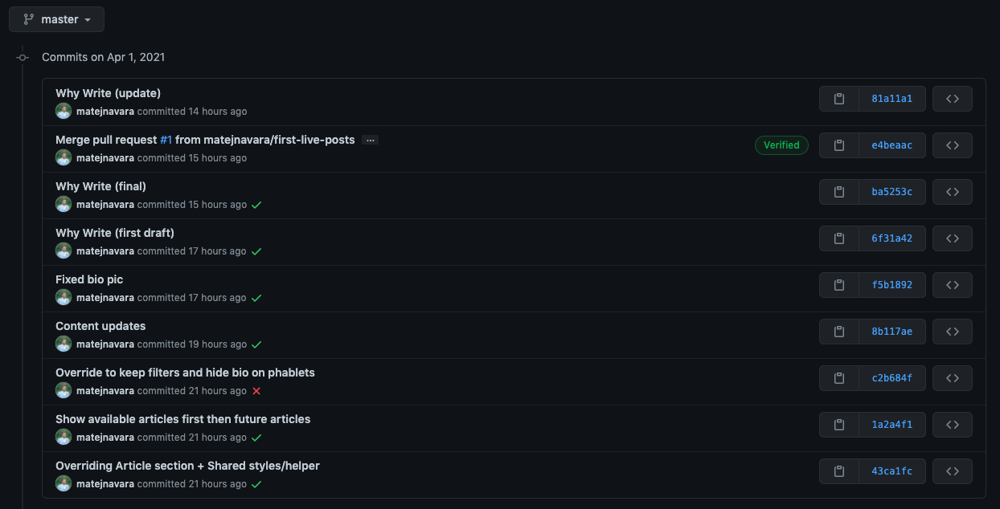

Now the articles look like the real deal!

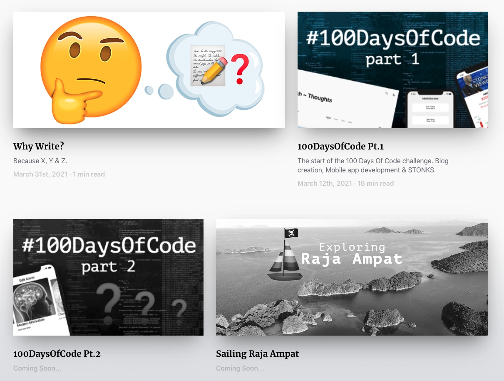

Not too shabby!

And finally it's now deployed on a proper domain with SSL and all (thanks Netlify 😘)

> www.TechABreak.blog ✨

Legit. Onwards!

---

## Day 33 - 02/04/2021

Today is some last minute cleanup and tweaks based off the initial feedback of the blog. Minor things mostly mobile optimisations on small phones.

So let's hit it.

| Before                                               | After                                              |
| ---------------------------------------------------- | -------------------------------------------------- |
| 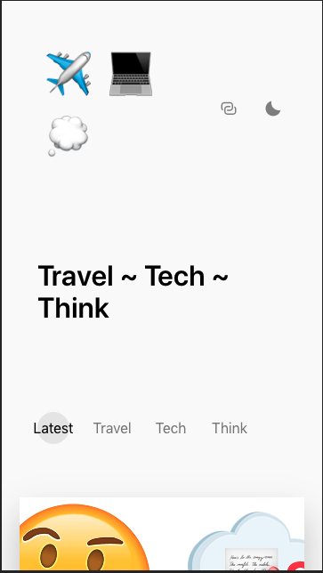   | 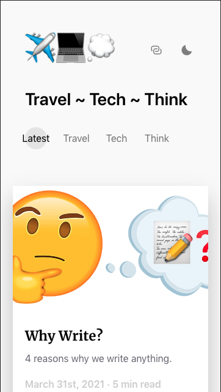  |
| 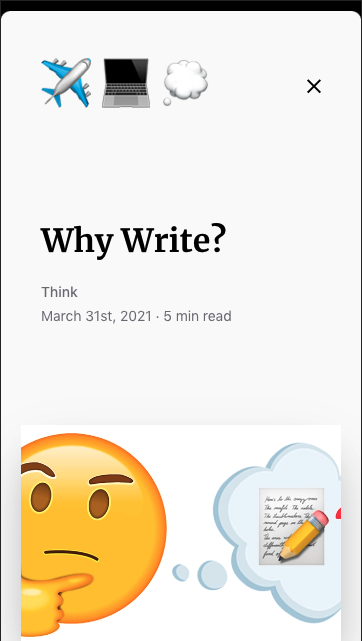 | 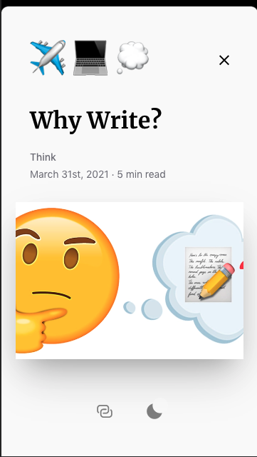 |

Simple padding changes that make a big difference and bring valuable content above the fold. On small devices screen space is a valuable commodity.

Now it's time to push and post.

Don't let perfection be the enemy of good. It's time to put it out there.


---

## Day 34 - 03/04/2021

Blog changes all done (for now) so I will jump back on the Motivication project. And perhaps I finally start the API itself!

For this today I will just set up a basic ExpressJS backend before adding the endpoints tomorrow.

SO, brand you fresh directory let's initialise a Node.js project and create a new `package.json`:

```
npm init
```

...then install Express as a dependency:

```
npm install express --save
```

...and create a quick basic Express server:

```js
const express = require("express");
const app = express();
const port = 3000;

app.get("/", (req, res) => {
  res.send("Start of Motivication API.");
});

app.listen(port, () => {
  console.log(`Example app listening at http://localhost:${port}`);
});
```

...finally just push to the new Git repository.

Bit of a quick cop-out day but tomorrow we will define all the existing endpoints to start using it on the app.

---

## Day 35 - 04/04/2021

Good morning, back to that API. All the quote data will be moved here. Alarm data will continue to be stored locally for now.

Let's define what we need for now:

| Route          | Request                                             | Response              | Description                                       |
| -------------- | --------------------------------------------------- | --------------------- | ------------------------------------------------- |
| GET /quote     | category: string                                    | quote: QuoteObject    | Returns a random quote of requested category type |
| GET /quotes    | userId: number                                      | quotes: QuoteObject[] | Returns all saved quotes for user                 |
| POST /rating   | { userId: number, quoteId: number, rating: number } | OK                    | Sends review for quote                            |
| PUT /rating    | { userId: number, quoteId: number, rating: number } | OK                    | Updates review for quote                          |
| DELETE /rating | { userId: number, quoteId: number, rating: number } | OK                    | Removes review for quote                          |

This also needed a bit more elaboration in terms of DB schema surrounding this area. So we have yet another crude whiteboard diagram:

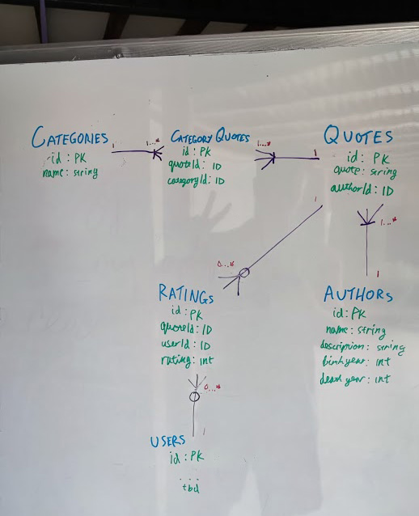

(I swear I will document this properly eventually...)

With the above in mind I continued to build out the API with the below structure:

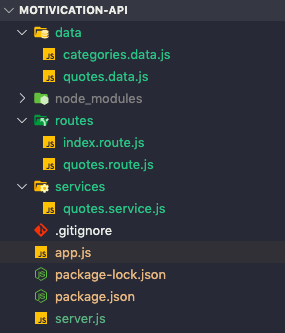

Currently just one route/service returning our bunch of dummy quotes data on `GET /quotes`.

It's a start. Happy Easter.

---

## Day 36 - 05/04/2021

Little bit of coders block in terms of which direction to go next, quite a few things to do and all rather different.

Regardless I opted to hook the mobile app up to the local API to pull quote data.

So on the backend API we have the endpoint `/quotes` prepared and serving the (currently dummy) data:

```ts
const quotes = require("../data/quotes.data");

module.exports = {
  getQuotes: (req, res) => {
    return res.status(200).json({ quotes });
  }
};
```

and on the mobile app client we will be calling the `/quotes` endpoint via Axios:

```ts
import axios, { AxiosResponse } from "axios";

interface Error {
  message: string;
  response?: AxiosResponse;
}

const api = axios.create({
  baseURL: process.env.REACT_NATIVE_API_URL,
  timeout: 3000
});

const handleError = (error: Error) => {
  return Promise.reject({
    message: error.message,
    data: error.response?.data,
    status: error.response?.status,
    error
  });
};

api.interceptors.response.use(
  response => response,
  error => {
    return handleError(error);
  }
);

export const getQuotes = async () => api.get("/quotes");
```

and tadaa we see it come through in the logged response:

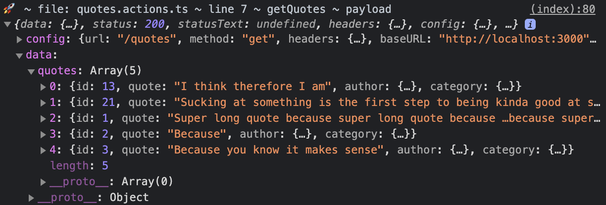;

Tomorrow I will populate these through the app and display them properly since the schama changed a bit as per the white board session.

---

## Day 37 - 06/04/2021

Thunk time today I think. Given the need for some async Redux actions in our app the Redux supported Thunk middleware is perfectly suited for the task.

Initially we will move the defined store out of our `App.tsx` and into it's own `Redux/store.ts` file shown below:

```ts
import { createStore, applyMiddleware } from "redux";
import thunk from "redux-thunk";

import rootReducer from "./reducers/root.reducer";

const middlewares = [thunk];

export const store = createStore(rootReducer, applyMiddleware(...middlewares));

// Infer the `RootState` and `AppDispatch` types from the store itself for TS typing
export type RootState = ReturnType<typeof store.getState>;
export type AppDispatch = typeof store.dispatch;

export default store;
```

The additional `RootState` and `AppDispatch` exports are used for the new `useAppDispatch` typed hook for use in the app. More info on this can be found in the [official Redux docs](https://redux.js.org/recipes/usage-with-typescript#define-typed-hooks).

Now we can do nice Async actions to fetch data, await response and dispatch success/failure appropriately:

```ts
export const getQuotesAsync = () => {
  return async (dispatch: AppDispatch) => {
    dispatch(fetchQuotes());
    try {
      const { data } = await getAPIQuotes();
      dispatch(fetchQuotesSuccess(data.quotes));
    } catch (error) {
      console.log("🚀 ~ file: quotes.actions.ts ~ getQuotesAsync error", error);
      dispatch(fetchQuotesFailure());
    }
  };
};
```

And once all hooked up (and Quote schema changed to include Author object), we can see the Quotes successfully pulling through:

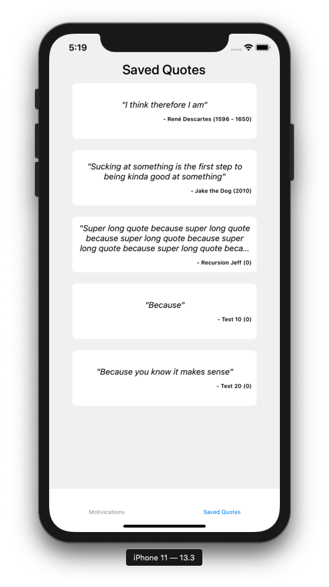

Happy days 🌞

---

## Day 38 - 07/04/2021

Some good news today; if all goes right, from Monday I will be applying these React Native skills to a leading UK Neuroscience company helping address mental health in young people! Happy days indeed!

Anyway without getting distracted we should add some additional API actions to our app. Busy/long day so nothing _WIIIIILD_ but let's (finally) hook up a PostgreSQL database.

The changes for this will be on the API side.
Currently for this project I've opted to use simple node-postgres for interfacing with PostgreSQL rather than a query/ORM.

First we want to add some new dependencies:

- `dotenv`
- `nodemon`
- `pg`
- `pg-hstore`
- `express-promise-router`

From here we will create our new DB connector in `db/index.js`:

```js
const { Pool } = require("pg");

const pool = new Pool({
  host: process.env.DB_HOST,
  database: process.env.DB_NAME,
  user: process.env.DB_USERNAME,
  password: process.env.DB_PASSWORD,
  port: process.env.DB_PORT
});

module.exports = {
  query: (text, params) => pool.query(text, params)
};
```

then we replace our existing route/service and use it like this:

```js
const Router = require("express-promise-router");
const db = require("../db");

const router = new Router();

/* Quotes Routes. */
router.get("/", async (req, res) => {
  const { rows } = await db.query("SELECT * FROM quotes");
  res.status(200).json({ rows });
});

module.exports = router;
```

Very basic but it's a start. Tomorrow I will actually set up the local DB with some seed data to start passing data from **DB -> API -> App**. Exciting times.

---
