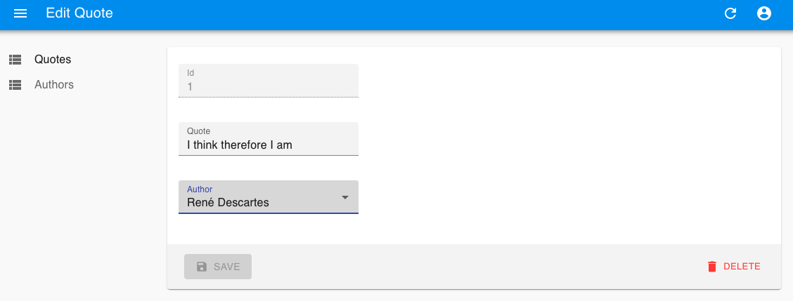

---

## 🄳🄸🅂🄲🄻🄰🄸🄼🄴🅁

This is not a structured blog post but a raw ongoing log of progress during the 100DaysOfCode challenge.

It is long. It isn't proof read or spellchecked. There will be bugs and typos.

Don't judge. You have been warned. Now go forth;
k


---

# **#100DaysOfCode Part 3** _(Day 41-60)_

## Day 41 - 10/04/2021

New day and start of chapter 3 of the 5 part blog documentation. I realise it's quite an unstructured mess so each one come with a disclaimer...

Anyway now after getting the whole `DB -> API -> App` flow working I will build out a few more endpoints. One big one is the core motivication endpoint which gets a random quote of the chosen category. This will be the basis of the motivication notification:

```js
router.get("/:categoryId", async (req, res) => {
  const { categoryId } = req.params;
  const { rows } = await db.query(
    `SELECT ${selectFullQuote("q", "a")}
      FROM category_quotes AS cq
      JOIN quotes AS q ON q.id = cq."quoteId"
      JOIN authors AS a ON a.id = q.author
      WHERE "categoryId" = ${categoryId}
      ORDER BY random()
      LIMIT 1`
  );
  res.status(200).json(rows[0]);
});
```

Next will be `/admin` endpoints in preperation for the Admin app that I want to start shortly, this will make interacting with the data and adding/updating information so much easier.

For this we will need CRUD endpoints for most of the models which won't be used by the app but will be needed for the admin app.

Below are basic CRUD routes for Authors.

```js
/* Admin Author Routes. */
router
  .route("/authors")
  .get(async (req, res) => {
    const { rows } = await db.query(`SELECT * FROM authors`);
    res.status(200).json(rows);
  })
  .post(async (req, res) => {
    const { author } = req.params;
    await db.query(
      `INSERT INTO authors(name,description,when)
        VALUES (${author.name}, ${author.description}, ${author.when})`
    );
  });

router
  .route("/authors/:authorId")
  .get(async (req, res) => {
    const { authorId } = req.params;
    const { rows } = await db.query(
      `SELECT * FROM authors
        WHERE id = ${authorId}`
    );
    res.status(200).json(rows[0]);
  })
  .put(async (req, res) => {
    const { authorId, author } = req.params;
    await db.query(
      `UPDATE authors
        SET name = ${author.name}, description = ${author.description}, when = ${author.when}
        WHERE id = ${authorId}`
    );
    res.status(200);
  })
  .delete(async (req, res) => {
    const { authorId } = req.params;
    await db.query(`DELETE FROM authors WHERE id = ${authorId}`);
    res.status(200);
  });
```

Quotes looks very much the same except I played around with including author as json and aggregating the categories (since one quote can have many categories):

```sql
SELECT q.id, q.quote, json_agg(c) AS categories, row_to_json(a) AS author
  FROM quotes AS q
  JOIN category_quotes AS cq on q.id = cq."quoteId"
  JOIN categories AS c on cq."categoryId" = c.id
  JOIN authors AS a on q.author = a.id
  GROUP BY q.id, a.id
```

Still all very messy but progress is progress.

---

## Day 42 - 11/04/2021

Sunday Sunday Sunday and it's day 42.

Little late in the day but will hit that Admin project setup. For this I will try out the popular admin framework [React Admin](https://marmelab.com/react-admin).

```
npx create-react-app motivication-admin
cd motivication-admin
yarn add react-admin ra-data-simple-rest prop-types
```

With a small start we already leverage much of the React Native framework:

```js
import * as React from "react";
import { Admin, Resource, ListGuesser, fetchUtils } from "react-admin";
import simpleRestProvider from "ra-data-simple-rest";

const apiUrl = "http://localhost:3001/admin";
const fetchJson = (url, options = {}) => {
  if (!options.headers) {
    options.headers = new Headers({ Accept: "application/json" });
  }
  return fetchUtils.fetchJson(url, options);
};
const dataProvider = simpleRestProvider(apiUrl, fetchJson);

const App = () => (
  <Admin dataProvider={dataProvider}>
    <Resource name="quotes" list={ListGuesser} />
  </Admin>
);

export default App;
```

The simpleRestProvider package from React Admin provides a simple data interface for CRUD interactions with pagination. This does require the following headers on the response for resource lists:

```js
res.set({
  "Access-Control-Expose-Headers": "Content-Range",
  "Content-Range": rows.length
});
```

But without too much difficulty we have the base of the admin system up and running within very little time!


Even though it just lists the quotes and authors for now it's crazy how quickly React Admin made this initial setup.

This is just the very beginning as we expand out the Admin/API to facilitate more interaction.

Onwards!

---

## Day 43 - 12/04/2021

Another day and continuing to build out the admin portal. It's been a good way to discover the needs of the API and interact with our models.

Today I created Quotes List, Create and Edit components based on the React Admin library which made it very simple to do so.

You can see these below:

### QuotesList


```js
export const QuotesList = props => (
  <List {...props}>
    <Datagrid rowClick="edit">
      <TextField source="id" />
      <TextField source="quote" />
      <ReferenceField label="Author" reference="authors" source="author">
        <TextField source="name" />
      </ReferenceField>
    </Datagrid>
  </List>
);
```

### QuotesCreate


```js
export const QuotesCreate = props => (
  <Create title="Add Quote" {...props}>
    <SimpleForm>
      <TextInput source="quote" />
      <ReferenceInput label="Author" reference="authors" source="author">
        <SelectInput optionText="name" />
      </ReferenceInput>
    </SimpleForm>
  </Create>
);
```

### QuotesEdit



```js
export const QuotesEdit = props => (
  <Edit title="Edit Quote" {...props}>
    <SimpleForm>
      <TextInput disabled label="Id" source="id" />
      <TextInput source="quote" />
      <ReferenceInput label="Author" reference="authors" source="author">
        <SelectInput optionText="name" />
      </ReferenceInput>
    </SimpleForm>
  </Edit>
);
```

Simple starts but working. Will progress to Authors and Categories next.

---

## Day 44 - 13/04/2021

Late sesh, changing data naming conventions. Following common Postgres best practices I've moved from camel case to snake case identifiers.

~~quoteID~~ -> **quote_id**

I also changed the ambigious author string field `when` to the rather more somber but data appropriate smallint fields `birth_year` and `death_year`. This will allow for better sorting/filtering of authors further down the line. I did consider using datetime fields and picking out the year on response but smalint seemed just fine.

These changes were reflected on DB, API and admin app.

---

## Day 45 - 14/04/2021

Starting the day by reversing some of what I did yesterday haha. After some consideration I think it does make more sense to have `birth_date` and `death_date` fields as actual date fields (no time). This will allow for more interesting uses down the line like "Born on this day X years ago" etc.

Postgres dates can store between 4,713 BC and 5,874,897 AD so I think we should be fine!

In some cases we won't have the full date but only a year in which case I will store as XXXX-01-01 and have a new boolean field of `has_full_date` set as false.

So let's do that.

New sql helper for the occasion:

```sql
  SELECT
  ${[authorAlias]}.name,
  ${[authorAlias]}.description,
  ${[authorAlias]}.birth_date,
  ${[authorAlias]}.death_date,
  ${[authorAlias]}.has_full_date,
  EXTRACT(YEAR FROM ${[authorAlias]}.birth_date) AS birth_year,
  EXTRACT(YEAR FROM ${[authorAlias]}.death_date) AS death_year,
```

Better I believe. Changes yet again made to API/Admin and now onwards.

---

## Day 46 - 15/04/2021

Today I decided on a little restructure of the API routes going forward, splitting apart the growing `admin.routes.js` file into seperate files within an `/admin` folder whilst doing the same for clientside routes within an `/app` folder.


I also extended the admin routes with CRUD endpoints for Categories and added these to the Admin app.


Noice.

---

## Day 47 - 16/04/2021

Next interaction I wanted to address was the relationship between quotes and categories via `category_quotes`. This won't be a route but a service create and delete functions for the junction relationships.

**_Some struggle later..._**

Bit of a mess, I will continue tomorrow. Long week...

---

## Day 48 - 17/04/2021

Alrighty today I came back to it with a fresh mind and resolved the issues surrounding `category_quotes` interacting with Admin.

### Listing categories on `GET /quotes`

This was with the following SQL select:

```sql
SELECT q.id, q.quote, q.author_id, COALESCE(json_agg(c) FILTER (WHERE c.id IS NOT NULL), '[]') AS categories
```

these can then be displayed using the `ArrayField` from React Admin and specifying the basePath towards the `/categories` route to link to editing.

```js
<ArrayField source="categories" basePath="/categories" fieldKey="id">
  <SingleFieldList>
    <ChipField source="value" />
  </SingleFieldList>
</ArrayField>
```

### Creating Quotes with `INSERT /quotes`

Easier to solve since it just shows all categories and each will be a new `category_quotes` row. React Admin lets us reference categories and post the source of `category_ids` to use in our API.

```js
<ReferenceArrayInput source="category_ids" reference="categories">
  <SelectArrayInput optionText="label" />
</ReferenceArrayInput>
```

Then on API we handle the provided array:

```js
if (category_ids && category_ids.length > 0) {
  const promises = category_ids.map(categoryId => {
    db.query(
      `INSERT INTO category_quotes (category_id, quote_id) VALUES(${categoryId}, ${newQuoteId})`
    );
  });
  await Promise.all(promises);
}
```

### Updating Quotes with `PUT /quotes/:quoteId`

This was a bit more tricky since we display existing categories on the edit page and then have to handle removing, adding and existing elements.

On React Admin this was handled similarly as the Create screen except the `GET /quotes/:quoteId` endpoint returns `category_ids` to populate the `ReferenceArrayInput`.

Similar to the list view except just returning an array of ids.

```sql
SELECT q.id, q.quote, q.author_id, COALESCE(json_agg(c.id) FILTER (WHERE c.id IS NOT NULL), '[]') AS category_ids
```

then on the API we need to compare the difference, what needs adding and what needs removing.

```js
const categoriesToAdd = category_ids.filter(
  x => !existingCategories.includes(x)
);
const categoriesToRemove = existingCategories.filter(
  x => !category_ids.includes(x)
);
```

these arrays then resovle to their appropriate SQL call:

```js
if (categoriesToAdd.length > 0) {
  const promises = categoriesToAdd.map(categoryId => {
    db.query(
      `INSERT INTO category_quotes (category_id, quote_id) VALUES(${categoryId}, ${quoteId})`
    );
  });
  await Promise.all(promises);
}

if (categoriesToRemove.length > 0) {
  const promises = categoriesToRemove.map(categoryId => {
    db.query(
      `DELETE FROM category_quotes WHERE category_id = ${categoryId} AND quote_id = ${quoteId}`
    );
  });
  await Promise.all(promises);
}
```

And there we have the CRUD functionality in Admin for full Quote creation.

Huzzah!

---

## Day 49 - 18/04/21

Today was cleanup of the API before jumping back to the app.

For this I went for the Manager/Worker model of Routes calling Controllers (managers) which use Services (workers). Naming of these may vary but the idea is the same.

Currently all the logic is on the route, which is grim. Not as much of a problem as the app is small but definitely not scalable.

So let's take an interesting example `PUT /admin/quotes/:quoteId`:

```js
put(async (req, res) => {
  const { quoteId } = req.params;
  const { quote, author_id, category_ids } = req.body;
  await db.query(
    `UPDATE quotes
        SET quote = '${quote}', author_id = ${author_id}
        WHERE id = ${quoteId}`
  );

  const { rows } = await db.query(
    `SELECT json_agg(category_id) AS category_ids FROM category_quotes WHERE quote_id = ${quoteId}`
  );
  const existingCategories = rows[0].category_ids;

  const categoriesToAdd = category_ids.filter(
    x => !existingCategories.includes(x)
  );

  if (categoriesToAdd.length > 0) {
    const promises = categoriesToAdd.map(categoryId => {
      db.query(
        `INSERT INTO category_quotes (category_id, quote_id) VALUES(${categoryId}, ${quoteId})`
      );
    });
    await Promise.all(promises);
  }

  const categoriesToRemove = existingCategories.filter(
    x => !category_ids.includes(x)
  );

  if (categoriesToRemove.length > 0) {
    const promises = categoriesToRemove.map(categoryId => {
      db.query(
        `DELETE FROM category_quotes WHERE category_id = ${categoryId} AND quote_id = ${quoteId}`
      );
    });
    await Promise.all(promises);
  }
  res.status(200);
});
```

there's way too much going on here so let's move the whole function into a Controller and start splitting out individual Services.

```js
const adminUpdateQuote = async (req, res) => {
  const { quoteId } = req.params;
  const { quote, author_id, category_ids } = req.body;
  try {
    await updateQuote(quoteId, { quote, author_id });

    const { rows } = await getQuoteCategories(quoteId);
    const existingCategories = rows[0].category_ids;

    const categoriesToAdd = category_ids.filter(
      x => !existingCategories.includes(x)
    );

    if (categoriesToAdd.length > 0) {
      const promises = categoriesToAdd.map(categoryId =>
        createCategoryQuote(categoryId, newQuoteId)
      );
      await Promise.all(promises);
    }

    const categoriesToRemove = existingCategories.filter(
      x => !category_ids.includes(x)
    );

    if (categoriesToRemove.length > 0) {
      const promises = categoriesToRemove.map(categoryId =>
        deleteCategoryQuote(categoryId, newQuoteId)
      );
      await Promise.all(promises);
    }
    res.status(200);
  } catch (error) {
    console.log(e.message);
    res.status(500).json(error);
  }
};
```

Definitely a bit neater and we have a bunch of new services we can reuse/test.

This was done for all the Quotes routes. Will do for the others tomorrow.

---

## Day 50 - 19/04/21

Half way through the challenge! As a little round-up so far I have:

- Created a GatsbyJS Blog (after building/comparing 2 platforms)
- Created a basic stocks watcher app for Android/iOS
- Started on passion project mobile app
- Created NodeJS API for the project
- Created ReactJS Admin portal for the project

Nice to see how much progress is made with consistency and dedicated practice.

Started new role in React Native today. Exciting times!

---

## Day 51 - 20/04/21

Today was a quick one, cleaned up the Author endpoints as with the Quotes.

```js
const Router = require("express-promise-router");

const {
  adminGetAuthorList,
  adminGetAuthor,
  adminUpdateAuthor,
  adminDeleteAuthor
} = require("../../controllers/admin/authors.controller");

const router = new Router();

/* Admin Author Routes. */
router
  .route("/")
  .get(adminGetAuthorList)
  .post(adminGetAuthorList);

router
  .route("/:authorId")
  .get(adminGetAuthor)
  .put(adminUpdateAuthor)
  .delete(adminDeleteAuthor);

module.exports = router;
```

---

## Day 52 - 21/04/21

Another quick one, it's my wife's birthday and time is of the essense. One more API refactor, this time for Categories.

### Fresh Categories Services

```js
const db = require("../../db");

const getCategories = async () => db.query("SELECT * FROM categories");

const createCategory = async ({ label, value, description }) =>
  db.query(
    `INSERT INTO categories (label, value, description) VALUES('${label}', '${value}', '${description}')`
  );

const getCategory = async categoryId =>
  db.query(`SELECT * FROM categories WHERE id = ${categoryId}`);

const updateCategory = async (categoryId, { label, value, description }) =>
  db.query(
    `UPDATE categories
      SET label = '${label}',
      value = '${value}',
      description = '${description}'
      WHERE id = ${categoryId}`
  );

const deleteCategory = async categoryId =>
  db.query(`DELETE FROM categories WHERE id = ${categoryId}`);

module.exports = {
  getCategories,
  createCategory,
  getCategory,
  updateCategory,
  deleteCategory
};
```

So fresh. Now these can be used in Controllers across the land. Noice.

---

## Day 53 - 22/04/21

Today I finally jumped back on the RN app side of the project after a lot of time on backend/admin.

Firstly merged in the `api-connect` branch to master. Next will be the actual notifications themselves.

After some consideration I decided to try out the `expo-notifications` API since we are in the expo ecosystem and it allows to schedule notifications fairly easy without integration with APN/FCM.

Mostly documentation research and some code cleanup.

---

## Day 54 - 23/04/21

Prior to diving in to the notifications feature I spent the end of the week testing and going through the API changes from this week to ensure all was working correctly.

During this I realised I was a few versions behind with Expo, currently v37, and the new `expo-notifications` API was introduced in v38. Latest at the time of writing is v41, each major release included really impressive improvements in terms of feature set, security and performance.

So I went ahead and upgraded to the latest with:

```
expo upgrade
```


Super easy.

Docs on upgrading and the latest versions is nicely presented in the [official docs](https://docs.expo.io/workflow/upgrading-expo-sdk-walkthrough/).

---

## Day 55 - 24/04/21

Now with the app running on latest Expo and a bunch of updated packages I am on some fixing duty. Dependency conflicts, lots of GitHub issues browsing and even a few fixes for API too.

Little things npm/expo updates and updating the clientside interfaces to match the new API response:

```ts
export interface QuoteProps {
  id: number;
  quote: string;
  author: AuthorProps;
  category: CategoryProps;
}

export interface AuthorProps {
  id: number;
  name: string;
  description: string;
  birth_date: string;
  death_date: string;
  has_full_date: boolean;
}
```

---

## Day 56 - 25/04/21

Given the new date format being passed to the App it looks a bit naff at the moment.

### Perfect task for quick Sunday hacky helper time ✨

| Before                                                 | After                                                 |
| ------------------------------------------------------ | ----------------------------------------------------- |
|  |  |

```ts
import moment from "moment";
import { AuthorProps } from "../Interfaces";

const formatDate = (date: string, fullDate: boolean) =>
  fullDate ? moment(date).format("Do MMM YYYY") : moment(date).format("YYYY");

export const getAuthorDate = (
  author: AuthorProps,
  fullDate: boolean = true
) => {
  const showFullDate = fullDate && author.has_full_date;
  const birthDate = author.birth_date
    ? formatDate(author.birth_date, showFullDate)
    : null;
  const deathDate = author.death_date
    ? formatDate(author.death_date, showFullDate)
    : "Present";

  return birthDate ? `${birthDate} - ${deathDate}` : "Unknown";
};
```

Simple but does the job, with flexibility to show full date on the QuoteView modal. Final format TBD but at least it's in one place.

---

## Day 57 - 26/04/21

Okay back to actual Notifications with `expo-notifications`.

Creating a little hook based off the docs to register and retrieve any notification.

```ts
import { useState, useEffect, useRef } from "react";
import { Platform } from "react-native";
import * as Notifications from "expo-notifications";
import Constants from "expo-constants";

Notifications.setNotificationHandler({
  handleNotification: async () => ({
    shouldShowAlert: true,
    shouldPlaySound: false,
    shouldSetBadge: false
  })
});

export const useNotification = () => {
  const [expoPushToken, setExpoPushToken] = useState("");
  const [notification, setNotification] = useState(false);
  const notificationListener = useRef();
  const responseListener = useRef();

  useEffect(() => {
    registerForPushNotificationsAsync().then(token => setExpoPushToken(token));

    notificationListener.current = Notifications.addNotificationReceivedListener(
      notification => {
        setNotification(notification);
      }
    );

    responseListener.current = Notifications.addNotificationResponseReceivedListener(
      response => {
        console.log(response);
      }
    );

    return () => {
      Notifications.removeNotificationSubscription(
        notificationListener.current
      );
      Notifications.removeNotificationSubscription(responseListener.current);
    };
  }, []);

  async function registerForPushNotificationsAsync() {
    let token;
    if (Constants.isDevice) {
      const {
        status: existingStatus
      } = await Notifications.getPermissionsAsync();
      let finalStatus = existingStatus;
      if (existingStatus !== "granted") {
        const { status } = await Notifications.requestPermissionsAsync();
        finalStatus = status;
      }
      if (finalStatus !== "granted") {
        alert("Failed to get push token for push notification!");
        return;
      }
      token = (await Notifications.getExpoPushTokenAsync()).data;
      console.log(token);
    } else {
      alert("Must use physical device for Push Notifications");
    }

    if (Platform.OS === "android") {
      Notifications.setNotificationChannelAsync("default", {
        name: "default",
        importance: Notifications.AndroidImportance.MAX,
        vibrationPattern: [0, 250, 250, 250],
        lightColor: "#FF231F7C"
      });
    }

    return token;
  }

  return notification;
};
```

Will put this to use in the app after I schedule some test notifications tomorrow. Will need to use a physical device for the testing since emulators don't get notifications.

---

## Day 58 - 27/04/21

And today everything is broken... Not quite sure why or how since everything was working. I did update my local dev environment to work on the new project so perhaps this is the root cause. I will start by the ol' classic....

> Turn it off and on again.

...well not quite, I will actually clean reinstall the app from the master branch. Kinda similar.

And Yup. It works.

So comparing the new broken `expo-notifications-implementation` with master revealed the simple (but stupid) mistake...


No idea how this happened. I will blame auto-lint maybe but should have clocked it when commiting the code. Sleepy mistakes.

Anyways that's a nice example of debugging which can happen at any point. This is why source control is awesome.

---

## Day 59 - 28/04/21

I know yesterday was a cop-out debug day but that's life. Recent week has been a bit distracted with lot's of things so 100Days got sidelined a bit.

That being said we're in again with more troubleshooting as my alarm screens are:

1. looking messed up on iOS (exhibit A)
2. broken (exhibit B)

| Exhibit A                                                  | Exhibit B                                             |
| ---------------------------------------------------------- | ----------------------------------------------------- |
|  |  |

This happens with updates sometimes, so let's see why and what's wrong so we can get our alarm screens looking healthy again!

Quite easy fixes:

### Exhibit A fix


Simply the `default` behaviour as defined by the [datetimepicker docs](https://github.com/react-native-datetimepicker/datetimepicker#display-optional) is:

```
Show a default date picker (spinner/calendar/clock) based on mode and Android version
```

We don't want that... we want spinner. So we specify spinner.

### Exhibit B fix


Another simple one, our `Category` object no longer has `index` so we just switch to `id` for now. Index is probably a good idea though, will add to DB model and API...

```
TODO: Be less lazy and make the better change toward index on API.. Thank you and goodnight.
```

---

## Day 60 - 29/04/21

For the final day of this post let's actually get notifications from the Motivication app!

This will need a physical device as our handy alert informs us:


So once we plug in a nice Android test device and trigger the scheduled test notifications (every 2 seconds, because why not...) using the following:

```ts
async function scheduleNotification() {
  await Notifications.scheduleNotificationAsync({
    content: {
      title: "Motivation Notification",
      body:
        "Sucking at something is the first step at being kinda good at something - Jake the Dog"
    },
    trigger: { seconds: 2 }
  });
}
```

We get:

|                                                              |                                                              |
| ------------------------------------------------------------ | ------------------------------------------------------------ |
|  |  |

Happy days!

Finally some genuine notifications, and what a good way to finish part 3!

In Part 4 I will focus on making this notification schedule correctly and populate with quotes dynamically.


