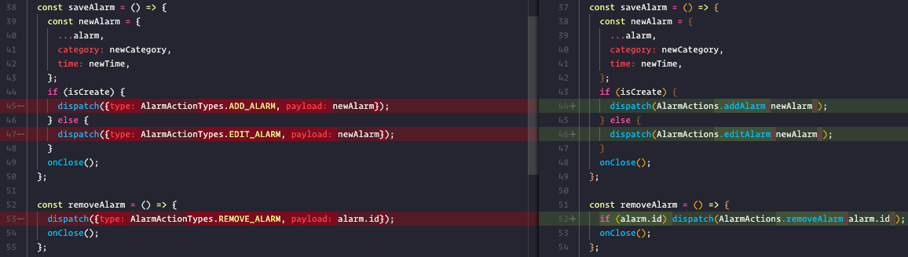
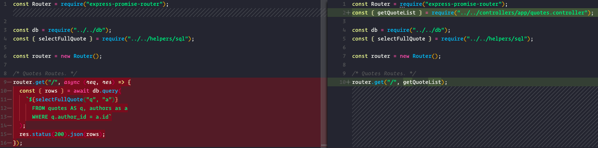
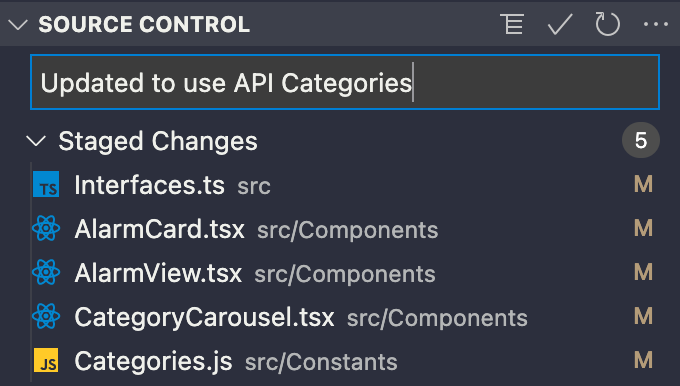
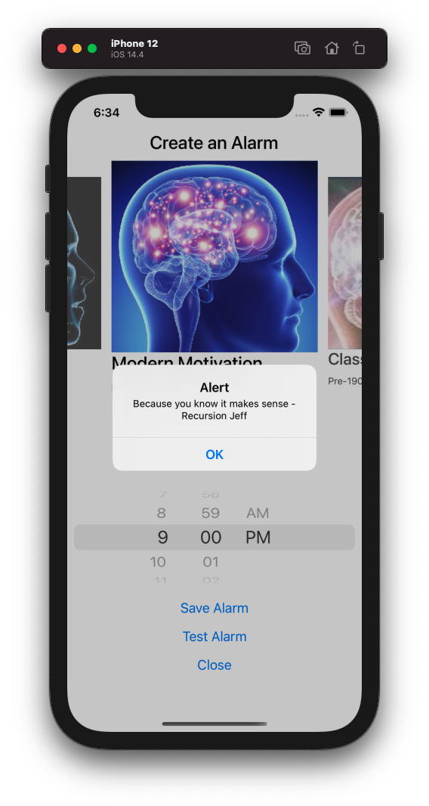

---

## 🄳🄸🅂🄲🄻🄰🄸🄼🄴🅁

This is not a structured blog post but a raw ongoing log of progress during the 100DaysOfCode challenge.

It is long. It isn't proof read or spellchecked. There will be bugs and typos.

Don't judge. You have been warned. Now go forth;
k


---

# **#100DaysOfCode Part 4** _(Day 61-80)_

## Day 61 - 30/04/2021

Start of part 4/5 is making this awfully real! The time is ticking and I want this app "done" by the end.

We will define what this definition of DONE means but it should be a functional MVP that is shareable.

As for this day I will do a little bit of housekeeping on the app front, noticed some oversights after returning from backend-land.

1. Redux actions not used consistently.

2. API is missing some App routes and controller/service structure

3. Categories are still pulling from constants.

Will hit the first now, second tomorrow and third day after. Busy days are limiting the time sadly.

Simple changes:


---

## Day 62 - 01/05/2021

Now the 2nd day of housekeeping on May Day.

Back in API land adding the necessary App routes for Categories we'll need for fix numero 3. Also restructuring to match the controller/services of the Admin App.



A much neater route.

---

## Day 63 - 02/05/2021

Calling the Categories from the API. These won't change often so perhaps just an initial call on load to update the store with some basic fallback to begin with for now.

Today adding the necessary Redux store/reducer/actions for Category fetching.

### REDUCER:

```ts
import { CategoryActionTypes } from "../ActionTypes";
import { CategoryProps } from "../../Interfaces";
import CATEGORIES from "../../Constants/Categories";

const INITIAL_STATE = {
  categories: CATEGORIES,
  loadingCategories: false
};

const categoriesReducer = (
  state = INITIAL_STATE,
  action: { type: any; payload?: CategoryProps[] }
) => {
  switch (action.type) {
    case CategoryActionTypes.FETCH_CATEGORIES_REQUEST:
      return { ...state, loadingCategories: true };
    case CategoryActionTypes.FETCH_CATEGORIES_SUCCESS:
      return { ...state, categories: action.payload, loadingCategories: false };
    case CategoryActionTypes.FETCH_CATEGORIES_FAILURE:
      return { ...state, loadingCategories: false };
    default:
      return state;
  }
};

export default categoriesReducer;
```

### ACTIONS:

```ts
import { AppDispatch } from "../store";
import { CategoryActionTypes } from "../ActionTypes";
import { CategoryProps } from "../../Interfaces";
import { getAPICategories } from "../../api";

const fetchCategories = () => ({
  type: CategoryActionTypes.FETCH_CATEGORIES_REQUEST
});

const fetchCategoriesSuccess = (categories: CategoryProps[]) => ({
  type: CategoryActionTypes.FETCH_CATEGORIES_SUCCESS,
  payload: categories
});

const fetchCategoriesFailure = () => ({
  type: CategoryActionTypes.FETCH_CATEGORIES_FAILURE
});

export const getCategoriesAsync = () => {
  return async (dispatch: AppDispatch) => {
    dispatch(fetchCategories());
    try {
      const { data } = await getAPICategories();
      dispatch(fetchCategoriesSuccess(data));
    } catch (error) {
      console.log("🚀 ~ getCategoriesAsync error", error);
      dispatch(fetchCategoriesFailure());
    }
  };
};
```

For now just call on AlarmScreen load:

```jsx
const AlarmScreen = () => {
  const dispatch = useDispatch();
  const {alarms, selectedAlarm} = useAppSelector((state) => state.alarms);
  const [modalVisible, setModalVisible] = useState(false);

  useEffect(() => {
    dispatch(getCategoriesAsync);
  }, []);
```

Definitely improvements to be made but it's okay for now.

---

## Day 64 - 03/05/2021

One issue with calling the Categories from the API is that the category images are currently only stored locally.

We could move these to an external location such as an S3 bucket and store the image path on the DB but I wish to keep it locally for now so to assign images to Categories I create the simple helper below.

```ts
const categoryImage1 = require("../Assets/mind-1.jpg");
const categoryImage2 = require("../Assets/mind-2.jpg");
const categoryImage3 = require("../Assets/mind-3.jpg");
const categoryImage4 = require("../Assets/mind-4.jpg");
const categoryImage5 = require("../Assets/mind-5.jpg");

const categoryImages = [
  categoryImage1,
  categoryImage2,
  categoryImage3,
  categoryImage4,
  categoryImage5
];

export const getCategoryImage = (index: number) => categoryImages[index];
```

Don't judge me 🤠

---

## Day 65 - 04/05/2021

May the Fourth be with you.

Today was actually spent on some more cleanup and fixing. Using the force to find bugs wherever they may be and improve the consistency/quality of the existing codebase.

Moving from:

```js
import { useStore } from "react-redux";

const store = useStore();
const state = store.getState();
const { alarms, selectedAlarm } = state.alarms;
```

to the more elegant:

```js
import { useAppSelector } from "../Hooks/redux";

const { alarms, selectedAlarm } = useAppSelector(state => state.alarms);
```

---

## Day 66 - 05/05/2021

Revenge of the fifth.

We got more work to do surrounding the API Categories and implementing them thoughout the app.

The category select being an obvious place to start. This now gets Categories passed in from the Selector. Changes were made to the `CategoryProps` interface and all areas using Categories shown below.



If you really want to see the specifics feel free to check the GIT commit [HERE](https://github.com/matejnavara/motivication-app/commit/d8efa90b572c8749e9876eea7cd5617a8a8ad942)

---

## Day 67 - 06/05/2021

Now back to the task at hand: NOTIFICATIONS.

For this I first need to extend the clientside API and Redux actions to hit our random quote endpoint.

`/app/quotes/:categoryId`

After the API endpoint defined on client:

```ts
export const getAPIMotivication = async (categoryId: number) =>
  api.get(`quotes/${categoryId}`);
```

we then connect up our Actions and Reducers:

```ts
const getMotivicationAsync = (categoryId: number) => {
  return async (dispatch: AppDispatch) => {
    dispatch(fetchMotivication());
    try {
      const { data } = await getAPIMotivication(categoryId);
      dispatch(fetchMotivicationSuccess(data));
    } catch (error) {
      console.log(
        "🚀 ~ file: quotes.actions.ts ~ getMotivicationAsync error",
        error
      );
      dispatch(fetchMotivicationFailure());
    }
  };
};
```

Next is hooking up to a front end test button to fire the endpoint with the appropriate category.

---

## Day 68 - 07/05/2021

Now that we get this random quote we have to display it in some way.

Adding a simple "Test Alarm" button on the Alarm View with the following script:

```ts
const testAlarm = async () => {
  const motivication = await dispatch(
    motivicationActions.getMotivicationAsync(newCategory.id)
  );
  alert(`${motivication.quote} - ${motivication.author.name}`);
};
```

and displays our new random quote:



Tada 🎉

---

## Day 69 - 08/05/2021

So as much as I would like to continue on Motivication stuff I have been pulled aside in prep for some work stuff.

Prepping the local dev environment to

---

## Day 71 - 09/05/2021

Now let's actually schedule it using the Notification API.

---

## Day 72 - 10/05/2021

And let's give the user an option to "Save" it.

---

## Day 73 - 11/05/2021

And let's give the user an option to "Save" it.

---

## Day 74 - 12/05/2021

And let's give the user an option to "Save" it.

---

## Day 75 - 13/05/2021

And let's give the user an option to "Save" it.

---

## Day 76 - 14/05/2021

And let's give the user an option to "Save" it.

---

## Day 77 - 15/05/2021

And let's give the user an option to "Save" it.
