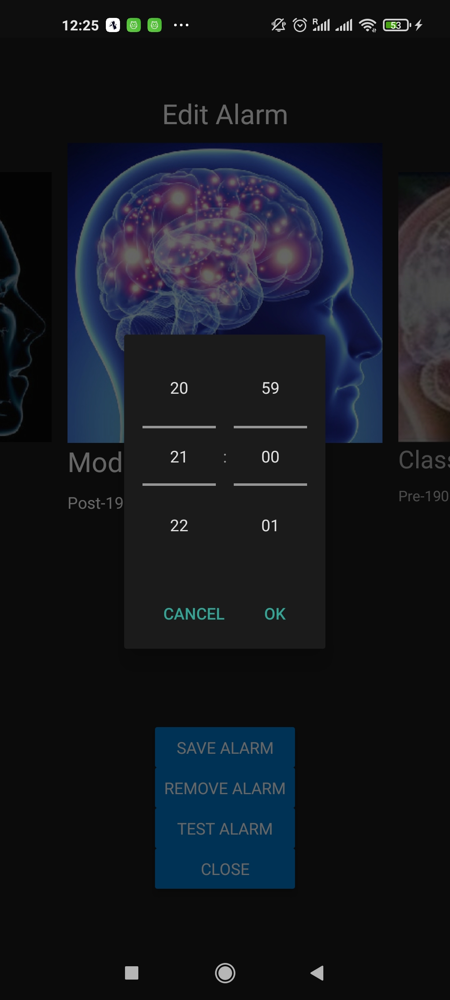
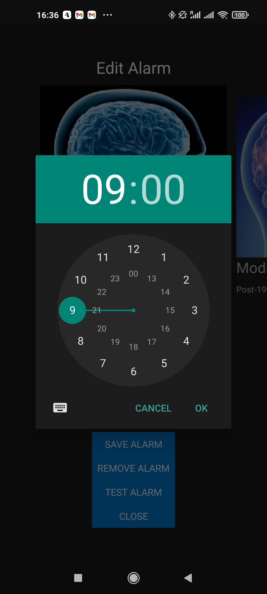
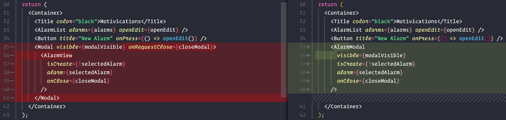

---

## 🄳🄸🅂🄲🄻🄰🄸🄼🄴🅁

This is not a structured blog post but a raw ongoing log of progress during the 100DaysOfCode challenge.

It is long. It isn't proof read or spellchecked. There will be bugs and typos.

Don't judge. You have been warned. Now go forth;


---

# **#100DaysOfCode Part 4** _(Day 61-80)_

## Day 61 - 30/04/2021

Start of part 4/5 is making this awfully real! The time is ticking and I want this app "done" by the end.

We will define what this definition of DONE means but it should be a functional MVP that is shareable.

As for this day I will do a little bit of housekeeping on the app front, noticed some oversights after returning from backend-land.

1. Redux actions not used consistently.

2. API is missing some App routes and controller/service structure

3. Categories are still pulling from constants.

Will hit the first now, second tomorrow and third day after. Busy days are limiting the time sadly.

Simple changes:


---

## Day 62 - 01/05/2021

Now the 2nd day of housekeeping on May Day.

Back in API land adding the necessary App routes for Categories we'll need for fix numero 3. Also restructuring to match the controller/services of the Admin App.


A much neater route.

---

## Day 63 - 02/05/2021

Calling the Categories from the API. These won't change often so perhaps just an initial call on load to update the store with some basic fallback to begin with for now.

Today adding the necessary Redux store/reducer/actions for Category fetching.

### REDUCER:

```ts
import { CategoryActionTypes } from "../ActionTypes";
import { CategoryProps } from "../../Interfaces";
import CATEGORIES from "../../Constants/Categories";

const INITIAL_STATE = {
  categories: CATEGORIES,
  loadingCategories: false
};

const categoriesReducer = (
  state = INITIAL_STATE,
  action: { type: any; payload?: CategoryProps[] }
) => {
  switch (action.type) {
    case CategoryActionTypes.FETCH_CATEGORIES_REQUEST:
      return { ...state, loadingCategories: true };
    case CategoryActionTypes.FETCH_CATEGORIES_SUCCESS:
      return { ...state, categories: action.payload, loadingCategories: false };
    case CategoryActionTypes.FETCH_CATEGORIES_FAILURE:
      return { ...state, loadingCategories: false };
    default:
      return state;
  }
};

export default categoriesReducer;
```

### ACTIONS:

```ts
import { AppDispatch } from "../store";
import { CategoryActionTypes } from "../ActionTypes";
import { CategoryProps } from "../../Interfaces";
import { getAPICategories } from "../../api";

const fetchCategories = () => ({
  type: CategoryActionTypes.FETCH_CATEGORIES_REQUEST
});

const fetchCategoriesSuccess = (categories: CategoryProps[]) => ({
  type: CategoryActionTypes.FETCH_CATEGORIES_SUCCESS,
  payload: categories
});

const fetchCategoriesFailure = () => ({
  type: CategoryActionTypes.FETCH_CATEGORIES_FAILURE
});

export const getCategoriesAsync = () => {
  return async (dispatch: AppDispatch) => {
    dispatch(fetchCategories());
    try {
      const { data } = await getAPICategories();
      dispatch(fetchCategoriesSuccess(data));
    } catch (error) {
      console.log("🚀 ~ getCategoriesAsync error", error);
      dispatch(fetchCategoriesFailure());
    }
  };
};
```

For now just call on AlarmScreen load:

```jsx
const AlarmScreen = () => {
  const dispatch = useDispatch();
  const {alarms, selectedAlarm} = useAppSelector((state) => state.alarms);
  const [modalVisible, setModalVisible] = useState(false);

  useEffect(() => {
    dispatch(getCategoriesAsync);
  }, []);
```

Definitely improvements to be made but it's okay for now.

---

## Day 64 - 03/05/2021

One issue with calling the Categories from the API is that the category images are currently only stored locally.

We could move these to an external location such as an S3 bucket and store the image path on the DB but I wish to keep it locally for now so to assign images to Categories I create the simple helper below.

```ts
const categoryImage1 = require("../Assets/mind-1.jpg");
const categoryImage2 = require("../Assets/mind-2.jpg");
const categoryImage3 = require("../Assets/mind-3.jpg");
const categoryImage4 = require("../Assets/mind-4.jpg");
const categoryImage5 = require("../Assets/mind-5.jpg");

const categoryImages = [
  categoryImage1,
  categoryImage2,
  categoryImage3,
  categoryImage4,
  categoryImage5
];

export const getCategoryImage = (index: number) => categoryImages[index];
```

Don't judge me 🤠

---

## Day 65 - 04/05/2021

May the Fourth be with you.

Today was actually spent on some more cleanup and fixing. Using the force to find bugs wherever they may be and improve the consistency/quality of the existing codebase.

Moving from:

```js
import { useStore } from "react-redux";

const store = useStore();
const state = store.getState();
const { alarms, selectedAlarm } = state.alarms;
```

to the more elegant:

```js
import { useAppSelector } from "../Hooks/redux";

const { alarms, selectedAlarm } = useAppSelector(state => state.alarms);
```

---

## Day 66 - 05/05/2021

Revenge of the fifth.

We got more work to do surrounding the API Categories and implementing them thoughout the app.

The category select being an obvious place to start. This now gets Categories passed in from the Selector. Changes were made to the `CategoryProps` interface and all areas using Categories shown below.


If you really want to see the specifics feel free to check the GIT commit [HERE](https://github.com/matejnavara/motivication-app/commit/d8efa90b572c8749e9876eea7cd5617a8a8ad942)

---

## Day 67 - 06/05/2021

Now back to the task at hand: NOTIFICATIONS.

For this I first need to extend the clientside API and Redux actions to hit our random quote endpoint.

`/app/quotes/:categoryId`

After the API endpoint defined on client:

```ts
export const getAPIMotivication = async (categoryId: number) =>
  api.get(`quotes/${categoryId}`);
```

we then connect up our Actions and Reducers:

```ts
const getMotivicationAsync = (categoryId: number) => {
  return async (dispatch: AppDispatch) => {
    dispatch(fetchMotivication());
    try {
      const { data } = await getAPIMotivication(categoryId);
      dispatch(fetchMotivicationSuccess(data));
    } catch (error) {
      console.log(
        "🚀 ~ file: quotes.actions.ts ~ getMotivicationAsync error",
        error
      );
      dispatch(fetchMotivicationFailure());
    }
  };
};
```

Next is hooking up to a front end test button to fire the endpoint with the appropriate category.

---

## Day 68 - 07/05/2021

Now that we get this random quote we have to display it in some way.

Adding a simple "Test Alarm" button on the Alarm View with the following script:

```ts
const testAlarm = async () => {
  const motivication = await dispatch(
    motivicationActions.getMotivicationAsync(newCategory.id)
  );
  alert(`${motivication.quote} - ${motivication.author.name}`);
};
```

and displays our new random quote:


Tada 🎉

---

## Day 69 - 08/05/2021

So as much as I would like to continue on Motivication stuff I have been pulled aside in prep for some work stuff.

Prepping the local dev environment to handle two 2FA github accounts.

Quite a good guide can be found [HERE](https://www.freecodecamp.org/news/manage-multiple-github-accounts-the-ssh-way-2dadc30ccaca/).

Mostly SSH config stuff.

Then some minor app alert improvements. Changing the title of the Alert from "Alert" to "Example".

Light day but at least the dual SSH config is sorted for easier seperation of work/personal.

---

## Day 70 - 09/05/2021

Back to Motivication. Let's actually schedule alarms using the Notification API.

```ts
async function scheduleNotification(category: CategoryProps, time: string) {
  await Notifications.scheduleNotificationAsync({
    content: {
      title: "Motivation Notification",
      body: "Test Notification for: " + category.label
    },
    trigger: {
      hour: moment(time).hour(),
      minute: moment(time).minute(),
      repeats: true
    }
  });
}
```

Curretly repeating every day at the given time.

---

## Day 71 - 10/05/2021

Today was a struggle wrestling with the Notifications.

I moved the registration and listeners to the App root for now and using (misusing) the `useNotification` hook to just access some key functions.

```jsx
export default function App() {
  const {registerForPushNotificationsAsync} = useNotification();
  const [expoPushToken, setExpoPushToken] = useState('');
  const [notification, setNotification] = useState(false);
  const notificationListener = useRef();
  const responseListener = useRef();

  useEffect(() => {
    registerForPushNotificationsAsync().then((token) =>
      setExpoPushToken(token)
    );

    // This listener is fired whenever a notification is received while the app is foregrounded
    notificationListener.current = Notifications.addNotificationReceivedListener(
      (notification) => {
        setNotification(notification);
      }
    );

    // This listener is fired whenever a user taps on or interacts with a notification (works when app is foregrounded, backgrounded, or killed)
    responseListener.current = Notifications.addNotificationResponseReceivedListener(
      (response) => {
        console.log(response);
      }
    );

    return () => {
      Notifications.removeNotificationSubscription(
        notificationListener.current
      );
      Notifications.removeNotificationSubscription(responseListener.current);
    };
  }, []);

```

Was nice to test the notifications firing from the handy [Expo Push Notifications Tool](https://expo.io/notifications).

But alas testing on a physical Android device revealed some shocking bugs. Fixing for tomorrow.

---

## Day 72 - 11/05/2021

Okay let's fix the Android bugs discovered yesterday.

Namely this horrible pop-over timepicker which breaks functionality if dismissed and can't be reopened:



Since Android manages date/time in a pop-over I will add a clickable date just for Android to toggle this.

The Android datepicker handles date changes and dismissal with the same onChange function so I extended to toggle the picker and to handle the `undefined` date passed in the case of dismissal.

```ts
const onChangeTime = (event: Event, date?: Date | undefined) => {
  if (Platform.OS === "android") {
    toggleAndroidPicker();
    if (date === undefined) return;
  }
  const currentDate = date || newTime;
  setNewTime(moment(currentDate).format("HH:mm"));
};
```

Also looks nicer now as the Android clock:



---

## Day 73 - 12/05/2021

Added a nice/simple toggle hook to use across the project. Replaced the Android clock toggle created yesterday.

```ts
import { useState } from "react";

const useToggle = (
  initState?: boolean
): [boolean, () => void, () => void, () => void] => {
  const [state, setState] = useState(initState || false);
  const toggle = () => setState(!state);
  const setTrue = () => setState(true);
  const setFalse = () => setState(false);

  return [state, toggle, setTrue, setFalse];
};

export default useToggle;
```

Feel free to steal my hooks 🎣

---

## Day 74 - 13/05/2021

Small day. 5 year anniversary with madam, singing an opera duet later as promised 3 years ago "if/when we made it to 5 years".

Promise made, promise kept.

Anyway codewise I just want to fix the alarm ordering.

Added a little helper to sort by time:

```ts
const numberTime = (time: string) => parseInt(time.replace(":", ""));

export const sortAlarms = (
  alarms: AlarmProps[],
  order: "ASC" | "DEC" = "ASC"
) =>
  alarms.sort((a, b) =>
    order === "ASC"
      ? numberTime(a.time) - numberTime(b.time)
      : numberTime(b.time) - numberTime(a.time)
  );
```

Now it's ordered. Noice.

---

## Day 75 - 14/05/2021

Refactored the AlarmView as AlarmModal to include the Modal. Makes more sense. Also yes a slow lazy day.



---

## Day 76 - 15/05/2021

Did the same as the above for the Quote screen with the difference of being for the saved and for the new motivications with a `isNew` flag.

The modal will display on any screen if a notification is selected.

New Motivication will take precident over any selected quote but the modals will be very much the same.

Playing around with triggering and managing the motivication modal.

---

## Day 77 - 16/05/2021

And then...


It was a Sunday in May and life got in the way. Truth be told there were a few slow and lackluster days leading up to this as you could see.

Coding continues on other fronts but the 100DaysOfCode challenge will not be the same. We'll do the postmortem in a proper write-up (TODO: future me please insert future link here) and crack on!

These things happen but that's okay. Have a lovely day. ✨
