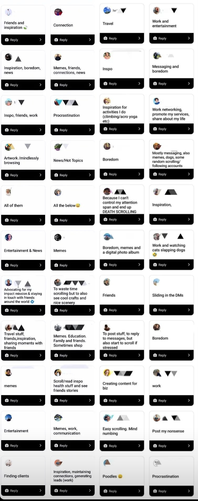
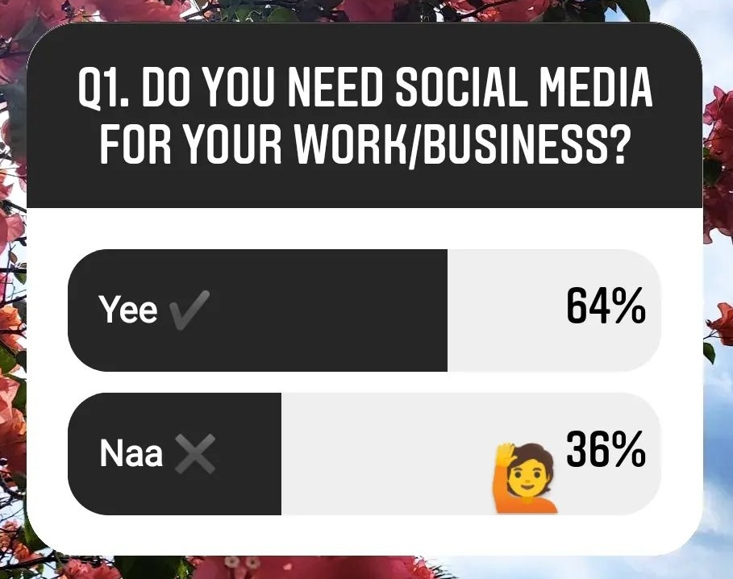
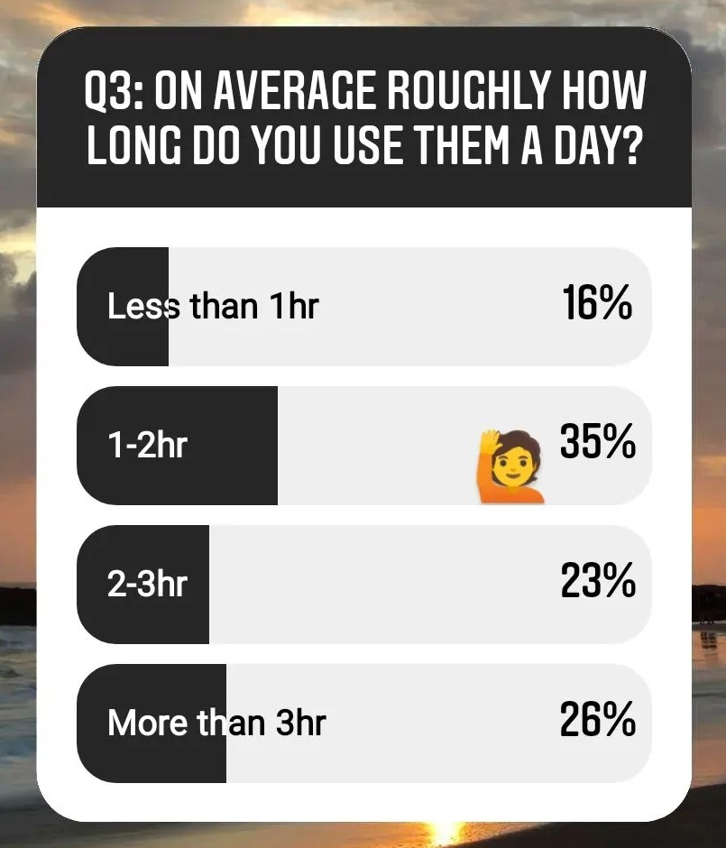
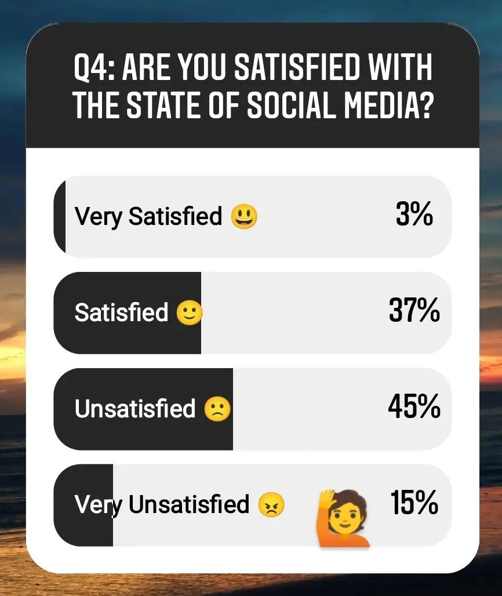

Social media platforms have become a prevalent part of our daily lives, pulling our attention from UP THERE 🌇 to DOWN HERE 📲 whilst we're in bed, on the toilet or out with friends.

Often it's just second nature, a bizarre habit that formed and before you know it you're scrolling through random cat videos or memes.

Now don't get me wrong I do love a good meme and there are plenty of positive elements of social media use _BUT_ there are plenty of negative elements that I'm sure we can all recognise.

So how do we weigh these up? Where do we draw the line? What separates healthy use and unhealthy use?

These are the questions I wish to bring to the forefront and start open discussions about how / why we use these platforms.

---

# But first things first, let's rewind a bit and get some context.

## If you were born in the 1900s read here:

Okay fellow old-timers we recall a time without portable devices let alone social media platforms. That means there was a point in which they slowly crept into our life and were steadily (usually voluntarily or even actively) adopted as a standard every day habit.

Habits do not form out of nowhere, so a quick thought exercise for you:

- **When / why did you first get a mobile device**

- **When / why did you first join a social media platform?**

- **What kept you coming back?**

## If you were born in the 2000s read here:

As GenZ and beyond you are the first "Digital Natives"; surrounded by tech, mobile devices and social media from maybe before you could walk. That is an interesting dynamic and quite frankly an unprecedented one. On one side you've had access to mass connection / information from the get go (see the positives below), on the other side you've also experienced the pitfalls from the same point (see negatives below).

I've already outed myself as an oldie but I still want to ask you similar three questions.

- **Do you recall the first time you were given a mobile device? (Phone/Tablet/Laptop/etc)**

- **Did / do you feel pressure in school based on what device you had or your social media presence?**

- **What would your days look like without any devices?**

## Now read on regardless of age:

The reason I start with this is to remind you that these devices/platforms are not a defacto. They are adopted, by us, seemingly willingly. And likewise they can be un-adopted, by us, hopefully willingly.

Though they seem like omnipotent behemoths they are just the current establishment. Bigger institutions have come and gone. What will be the status quo in 5 years? In 20 years? In 50 years? Well that will be for us to decide since we _choose_ which platform to focus our attention on and these platforms constantly compete for that attention.

**Make no mistake, in the digital age we are constantly voting with where we put our attention. This is known as the "Attention Economy"**

---

# The Good

Now although you can see the tone of this article is fairly critical of social media it by no means discounts the multitude of benefits it brings.

Once again the positives are very personal and subjective but polling my limited sample there seemed to be a few common themes we can all unilaterally appreciate:

- Connecting with friends / family
- Safe space / like-minded communities
- Learning something new
- Finding inspiration
- Unwinding and entertainment
- Memes

Here were some of the raw responses:

There is also another factor I didn't appreciate prior to diving into this investigation and that is the quantity of people who are employed within some social media related roles or use it within their business. (granted this limited poll was conducted via a social media platform so fairly bias)

So +1 for team positive:

- Work opportunities

Despite the bias and whether working with social media is willingly or out of necessity the application within business is clear. Almost every public facing business is expected to have some element of "social presence" within the current climate.

For businesses; it opens up new markets, reaches wider audiences and gathers valuable market research data all much easier than before.

For individuals; it opens up new avenues of working, grants opportunities to try new ideas / businesses of their own and both of which often allow newly remote or flexible working. This flexibility opening up opportunities to live life in new ways.

Whatever the state of social media may be, there will always be strong impact on both our business and personal lives.

# The Bad

Now following the positive points we have the other side of the coin, the negatives:

- Disconnecting from friends / family physically around you
- Increased anxiety / depression / envy / self-consciousness / loneliness
- Heightened FOMO (Fear of Missing Out)
- Unrealistic expectations
- Unhealthy sleep patterns
- General addiction
- Cyberbullying
- Doom-scrolling
- Time wasting

These are a few of the common themes widely discussed across various studies and observations. Perhaps you have experienced some of these or perhaps you haven't but I'm sure we can all appreciate that these are some negative ways in which people are affected.

Whilst there can be deeper analysis of each of these points I do not wish to expand on the negatives much like the positives in this particular article. There are numerous research based write-ups available online for both the negatives and positives:

# The Ugly

The ugly truth is that whether we use social media positively or negatively it often takes up a lot of time and mental capacity. It's not even the quantity of time itself but the intermittent distractions throughout the day. It's the mental focus equivalent of a _COMBO BREAKER_ interrupting your flow state for the simple desire of responding to a message or seeing who liked your new post.

Whether we use these platforms for good or bad I think we can all agree that this is a major factor. In this age of "Attention Economy" these platforms are literally designed to pull your focus and keep you coming back. From the curated feeds tailored to our tastes to the dopamine dosing feedback loops that carry all the hallmarks of an addictive habit.

From a brief anecdotal poll of my limited sample of social media friends (by no means representative sample) it was interesting to see the usage:

I too fell in the 1-2 hour/day bracket so let's use 1.5 hours a day as an example calculation.

| Timeframe | Social Media Screen time |
| --------- | ------------------------ |
| 1 day     | 1.5 hrs                  |
| 1 week    | 10.5 hrs                 |
| 1 month   | 45 hrs                   |
| 1 quarter | 136.5 hours              |
| 1 year    | 547.5 hours              |

So in a year of 1.5 hour/day average social media usage you will have spent almost _23 FULL DAYS_ staring at your screen.

That's a lot of time. And some of us have double these values...

---

# Why are we discussing this?

To put into context the scale of our social media habits and also open the dialogue surrounding this.

From my aforementioned anecdotal poll it seems the majority of users are unsatisfied with the state of social media and it's use (myself included).

Everyone has their own personal reasons but personally the time component was the key point for me. Another important point is the negative impact on our mental performance.

One combination of factors coined by Jim Kwik are the _"FOUR HORSEMEN OF THE DIGITAL AGE"_ affecting our mental capabilities. These apply quite effectively to social media use and how it impacts our brain's performance.

### Digital Deluge

_The quantity of information._ We now consume three times the amount of information as someone from the 1960s and as much information in a single day as an average person from the 1400s would have absorbed in a lifetime. Yet physiologically we are not very different to our distant relatives hundreds of years ago. No wonder our brains can feel frazzled from this information overload.

### Digital Distraction

_The distraction of information._ Notifications hundreds times a day pulling your attention to the latest news story or a text message from mum or a like on your post or an app reminder to do yoga or whatever may make your phone buzz/chime. It's no wonder we can't focus on our tasks when we get interrupted every few minutes or feel the impulse to pick up our phones. Very distracting...

### Digital Dementia

_The forgetting of information._ By having information stored in our devices our brain's short-term memory capabilities are quite literally deteriorating. When was the last time you remembered a phone number? Or directions to a location you have visited numerous times? When it's so easily accessible our brain sees no motivation to recall it, we opt to reach for our phone rather than our mind. The neural pathways are not reinforced and our brain forgets.

### Digital Deduction

_The reliance on information._ Why have your own opinion when you can crowd-source the opinions of the digital masses. Metacritic, Rotten Tomatoes, IMDb, Goodreads or literally any news/social forum will happily provide you with opinions on any subject. No need for critical / creative thinking here, let's just think the same. What could possibly go wrong?

  

You can read a full breakdown of these horsemen much more eloquently written and with supporting research in Jim Kwik's book Limitless.

Now enough doom & gloom, onwards 🐎

# How can we change the way things are?

### "But this is just how things are. What difference will my choice make?" said 8 billion people

There are always methods we can take even at a personal level and perhaps encourage / normalise in our communities.

### Awareness

It starts with awareness. Being conscious of how we use our devices and social media.

Am I scrolling whilst sitting with friends/family? Am I scrolling before sleeping? Or perhaps immediately after waking up?

No judgement here but it's a prompt to be introspective of your own actions. Stop and think for a moment or catch yourself in these moments when perhaps you'd rather not get sucked in. Maybe it's the quantity of use you wish to reduce.

Whatever it is for you, once you are aware of it. You can action on it.

### Social media breaks

Something I am a great believer of are intentional breaks to reset the habits. Simply log-out / uninstall from your devices and carry on with your life. The world keeps on spinning and you won't miss as much as you'd think.

I say this in the middle of my longest intentional break yet of 3 months. Using our time use chart above that equates to roughly 136 hours or 5.5 full days of time I have reclaimed. There is no doubt in my mind that this article would not be getting written without this intentional break.

A break, however long, acts as a reminder of just how much it pulled your focus as well as weening your brain from the constant dopamine drip feeds.
You brain will start searching for stimulation in new places and you can harness this to create new positive habits in the void of the previous ones.

Much of our studies of habit science tell us that unlearning a habit usually requires a replacement.

So choose what you would rather do; read? gym? call family? write a blog?

You can decide how you use your newly gained time.

### Controlled use

Maybe going cold turkey isn't for you because you need it for work/connection or you simply don't want to go to fully disconnect.
That is fine and an alternative would be to restrict the usage. There are a number of modern mechanisms on phones to restrict usage to a certain amount of time or during certain times of the day.
This prevents the default scrolling habit which is generally the most intrusive.

Having some restriction will also make you value and appreciate the limited time more.
Your use may naturally become more intentional (more on this in a second).

With this method you can experiment in different ways, perhaps you will check your social media in the morning and in the evenings.
Maybe you will only go on during the weekends to focus during the week.
This balanced method is a best of both worlds approach where you don't get out of the loop by going offline for large portions of time yet you still address the persistent interruptions and habitual use.

One other slightly more extreme method in this category, if you can't trust yourself to not override any app restrictions on your phone, is to use social media on another device.
This can be your laptop or a backup phone which won't be as quickly accessible as your day-to-day phone. As mentioned there is a lot of room for personal experimentation to see what works for you.

### Intentional use

Finally we come to the intentional use where we ask why and what do you want it for.
Really analyse and reflect on the purpose you wish to fulfill with using these platforms. It can be anything, often linked to the positives mentioned earlier.
If you are just an avid meme queen then so be it, follow the best accounts and enjoy the finest doses of memes in an intentional way.

Often these platforms will operate across many of our needs so we really need to refine what we want to focus on. An example routine could be:

- Monday I will catch-up on recent tech news
- Tuesday I will reach out to friends for their weekend plans
- Wednesday I will post for my business
- Thursday I will engage with the previous post
- Friday I will check events for the coming week
- Saturday I will use however I want (for X amount of time)
- Sunday I will meme scroll to my hearts content, it is the day of rest after all.

It can be whatever you want but the important aspect is that it is _INTENTIONAL_. You are not just getting sucked in and spun around from post to post until you end up deep in the rabbit hole reading about how to make a wooden bench.

Although these miscellaneous online mis-adventures can be fun and you gain all sorts of random pub quiz knowledge, mostly the information won't stick and the time spent is non-refundable.

Instead if your intention that day is to go looking for new content or learning how to make a wooden bench, well then this rabbit hole is perfect for you 🐰

So if you set an intention and plan your social media use then you use the platform well, if you don't... then the platform uses you well.

# What does good / healthy use look like?

Now this is the million dollar question. How to enjoy the positives without the negatives. How to have your cake and eat it too. Is this balance even possible?

Ultimately good / healthy social media use is very individual. As long as it enriches your life more than detracts from it that is a good baseline valuation of it's impact.

- If it connects you to friends, family and opportunities around the world without making you anxious or giving you FOMO.

- If it inspires you and entertains you without sucking you in for hours a day.

- If you use the platform rather than the platform using you.

These are all signs you're barking up the right tree of balance. Personally I say it is rarely so simple, the relationship with these platforms ebbs and flows like any other area of life.
Sometimes it's more balanced, sometimes it's less.

Perhaps what is the most important is just having the honest awareness to regularly check in with yourself to see where you sit on this scale.
See where perhaps you need to tip the scales in one direction, engaging more to leverage the benefits of these platforms or disconnecting to reconnect with the real world.

Wherever you may be in your balance journey I hope we can all strive for a happier and healthier balance.

---

## TL;DR

###### (To Long; Didn't Read)

- Social media is a dual edged sword of pros and cons.

- Our current social media culture is not a de facto. It is recent adopted and subject to change.

- **Big negative 1:** Time loss.

  - 1.5hr / day
  - 10.5hr / week
  - 45hr / month
  - 547.5hr / year. That's a lot of time.

- **Big negative 2:** Cognitive impact from the four horsemen of the digital age;

  - Digital deluge - _The quantity of information._
  - Digital distraction - _The distraction of information._
  - Digital dementia - _The forgetting of information._
  - Digital deduction. - _The reliance on information._

- **Ways to balance the scales:**
  - Awareness
  - Social media breaks
  - Controlled use
  - Intentional use

---

Thank you for taking the time today to hear my thoughts.

I would love to hear any input of what is your thoughts surrounding social media or any feedback on something you may agree / disagree with.

This blog will become a home of 3 types of content:

- **Travel**: Experiences, tips, guides and recommendations from different destinations I stumble through.
- **Tech**: Walkthroughs, tutorials, hacks and discussions as I bumble through the ever changing tech landscape.
- **Thoughts**: Ideas, questions, debates and theories on things that may wander though my mind.

Stay tuned ✨
